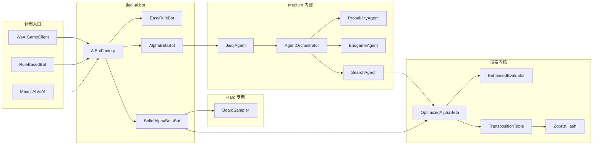

# AI 算法设计

> 揭棋对弈系统 **Unveil** · 技术设计文档  
> 实现位置：`jieqi-ai` → `com.jieqi.ai`、`com.jieqi.ai.bot`、`com.jieqi.ai.agent`、`com.jieqi.ai.belief`  
> 关联文档：[RULE_ENGINE_DESIGN.md](./RULE_ENGINE_DESIGN.md) · [ARCHITECTURE.md](./ARCHITECTURE.md)

---

## 1. 设计目标与约束

| 目标 | 实现手段 | 状态 |
|------|----------|------|
| 走法必须合法 | `generateLegalMoves` + 最终 `fallback` 首步合法走法 | ✅ 已实现 |
| 不透视对手暗子 | 搜索前调用 `board.createAiPublicView(color)` | ✅ 已实现 |
| 按时返回 | `timeLimitMs` 截止 + `abortSearch` + 浅层 fallback | ✅ 已实现 |
| 三档难度可感知 | `EasyRuleBot` / `AlphaBetaBot` / `BeliefAlphaBetaBot` | ✅ 已实现 |
| 暗子期望值 | `EnhancedEvaluator.evaluateMaterial` 对暗子按 `virtualType` 估值 | ✅ 已实现 |
| 长将规避 | `repetitionRisk` 惩罚 + `Game.getRepetitionCount()` | ⚡ 已实现-待强化 |

**硬约束**：AI 模块仅依赖 `jieqi-core`，不依赖 `jieqi-server`；网络对弈时由 `WsAIGameClient` 或服务器 `RuleBasedBot` 调用 `AiBot` 接口。

---

## 2. 三档 AI 对照表

| 维度 | Easy（入门） | Medium（标准） | Hard（挑战） |
|------|--------------|----------------|--------------|
| 实现类 | `EasyRuleBot` | `AlphaBetaBot` → `JieqiAgent` | `BeliefAlphaBetaBot` |
| 搜索算法 | 无深度搜索 | Alpha-Beta + 置换表 + 迭代加深 | Belief Sampling + 局部 Alpha-Beta |
| 子 Agent | 无 | `ProbabilityAgent` → `EndgameAgent` → `SearchAgent` | 无（直接采样） |
| 搜索深度 | 0 | 迭代加深至深度 ≥ 8（时间允许时） | 每采样 4–6 层（预算切分） |
| 暗子处理 | 公开视角 | 公开视角 | 对对手暗子采样确定化 |
| 时间预算 | < 500 ms | ~5 s（可配置） | ~5 s（24 次搜索量级） |
| 随机性 | 30% 全随机 + 70% Top-K 随机 | 无（确定性搜索） | 采样随机性 |
| 工厂入口 | `AiBotFactory.create(EASY)` | `AiBotFactory.create(MEDIUM)` | `AiBotFactory.create(HARD)` |

参数来源：`AiConfig.forLevel(level, humanBudgetMs)`。

---

## 3. 整体架构



---

## 4. 搜索算法详解

核心实现：`OptimizedAlphaBeta`（`com.jieqi.ai`）。

### 4.1 Alpha-Beta 剪枝

**原理**：在极大极小搜索中维护窗口 `[alpha, beta]`。若某分支得分 ≤ alpha（己方已有更好选择）或 ≥ beta（对方有更强反击），则剪枝不再展开。

**揭棋适用性**：揭棋分支因子大（暗子按 virtualType 走法多），剪枝对 Medium 档性能至关重要。搜索在 `createAiPublicView` 脱敏后的棋盘上进行，避免假设对手暗子真实身份。

```
function alphaBeta(board, color, depth, alpha, beta):
    if depth == 0: return quiescence(...)
    for each ordered move:
        make(move)
        score = -alphaBeta(opp, depth-1, -beta, -alpha)
        unmake(move)
        alpha = max(alpha, score)
        if alpha >= beta: break  // beta 剪枝
    return alpha
```

### 4.2 迭代加深（Iterative Deepening）

根节点从 `depth = 1` 递增至 `MAX_DEPTH = 20`，每层复用上一层最优走法排序。时间不足时保留**已完成层**的最优结果。

| 策略 | 说明 |
|------|------|
| 时间预测 | `remaining < lastDepthElapsed * 2` 且 `depth ≥ 3` 时停止加深 |
| 绝杀提前退出 | 分数接近 `INF` 时不再加深 |
| 历史表老化 | 每 4 层 `history.age()` 衰减旧走法权重 |

### 4.3 置换表（Transposition Table）

| 项目 | 说明 |
|------|------|
| 哈希 | `ZobristHash.computeHash(board)` |
| 存储 | 深度、分数、边界标志（EXACT / LOWER / UPPER）、最佳走法 |
| 查询 | 非 PV 节点且 `ttEntry.depth ≥ 当前 depth` 时尝试截断 |
| 用途 | 避免重复子树搜索、辅助走法排序 |

### 4.4 杀手启发（Killer Heuristic）

Beta 剪枝时，将当前深度导致剪枝的**非吃子**走法记入 `KillerHeuristic`。同深度兄弟节点搜索时优先尝试杀手走法，提高剪枝效率。

### 4.5 历史启发（History Heuristic）

当某走法使 alpha 提升时，`history.recordMove(move, color, depth)` 增加该走法历史分。走法排序时历史分高的优先搜索。

### 4.6 静态搜索（Quiescence Search）

叶节点（`depth == 0`）不直接评估，而是进入静态搜索：

| 项目 | 说明 |
|------|------|
| 扩展范围 | 仅吃子走法 |
| 最大深度 | 3 层 |
| 评估 | `standPat = EnhancedEvaluator.evaluate` + `evalBias` |
| 早停 | `standPat ≥ beta` 时 beta 截断 |

### 4.7 SEE 静态交换评估

`StaticExchangeEvaluator.see(board, move)` 模拟目标格连续交换，估计吃子序列净收益。

| 用途 | 说明 |
|------|------|
| 静态搜索排序 | 按 SEE 降序尝试吃子 |
| 过滤 | `SEE < 0` 的吃子直接跳过，避免「用车换兵」污染评估 |
| 根排序 | 根节点用 MVV-LVA 代替 SEE（性能考虑） |

### 4.8 晚着减少（LMR, Late Move Reduction）

| 条件 | 操作 |
|------|------|
| 非吃子、非将军 | `searched ≥ 4` 且 `depth ≥ 3` 且非 PV 节点 |
| 减少量 | `reduction = 1`（先以 `depth-1-reduction` 零窗口探测） |
| 重搜 | 若分数落在窗口内，以完整深度重搜 |

### 4.9 渴望窗口（Aspiration Window）

迭代加深 `depth ≥ 2` 时，以上一层分数 `bestScore ± ASPIRATION_WINDOW(80)` 作为初始窗口。若结果落在窗口外，以 `[-INF, +INF]` 重搜该层。

### 4.10 长将规避（repetitionRisk）

```
若 执行候选步后：
    对手被将军 AND
    repetitionCount[positionKey] + 1 >= REPETITION_DANGER(5)
则：
    对该步分数施加 REPETITION_PENALTY(100000)（非绝杀步）
```

`repetition` 来自 `Game.getRepetitionCount()`，与规则层长将判负（6 次）对齐但提前规避。

---

## 5. 评估函数（EnhancedEvaluator）

`evaluate(board, currentColor)` 返回**对 currentColor 有利**的整数分数（正 = 好）。

### 5.1 七维结构

| 维度 | 方法 | 权重思路 | 说明 |
|------|------|----------|------|
| 子力 material | `evaluateMaterial` | 帅 10000、车 900、马 400、炮 450… | 明子固定值；暗子按 `virtualType` 均值 + `DARK_PIECE_BONUS` |
| 位置 position | `evaluatePosition` | 车马炮兵位置分表 | 仅明子；黑方行翻转查表 |
| 机动性 mobility | 走法列表 size × `MOBILITY_WEIGHT` | 合法走法越多越好 | 双方各生成一次走法列表复用 |
| 将帅安全 kingSafety | `evaluateKingSafety` | 士象邻格护卫 +30 | 无明将则 -100000 |
| 威胁 threats | `evaluateThreats` | MVV-LVA 风格 | 复用预生成走法，估算吃子威胁 |
| 兵形 pawnStructure | `evaluatePawnStructure` | 相邻兵卒加成 | 鼓励兵链 |
| 残局猎杀 kingHunt | `evaluateKingHunt` | 子力少时压迫对方将 | 残局阶段权重上升 |

### 5.2 暗子子力估值

```
对每个未翻开棋子：
    darkValueSum += getBaseValue(virtualType)
material += (darkValueSum / darkCount) * darkCount + darkCount * DARK_PIECE_BONUS
```

明子过河兵、过河士象有额外 `CROSSED_PAWN_BONUS` / `CROSSED_MINOR_BONUS`。

### 5.3 性能优化

每次 `evaluate` 仅调用 2 次 `generateAllMoves`（红黑各一），将列表透传给机动性与威胁评估，避免叶节点重复生成（原先可达 6 次）。

---

## 6. 揭棋隐藏信息处理

### 6.1 AI 公开视角：`createAiPublicView`

| 棋子类型 | 处理方式 |
|----------|----------|
| 己方明子 | 保留真实 `type` |
| 己方暗子 | 保留真实 `type`（服务器/权威棋盘知悉己方暗子） |
| 对手明子 | 保留真实 `type` |
| 对手暗子 | `type ← UNKNOWN`，保留 `virtualType` |

脱敏棋盘上对手暗子翻开时，`resolveRevealType` 仅暴露 `virtualType`，搜索树内不透视真实身份。

### 6.2 Hard 档：Belief Sampling

**流程**（`BeliefAlphaBetaBot`）：

```
publicView = createAiPublicView(color)
candidates = Top-N 启发式排序合法走法
for each candidate:
    for sample in 1..beliefSamples:
        sampleBoard = BoardSampler.fromPublicView(publicView, color, rng)
        make(candidate) on sampleBoard
        score -= OptimizedAlphaBeta.search(sampleBoard, opp, perSampleBudget)
    选期望分最高的 candidate
```

**`BoardSampler.fromPublicView` 逻辑**：

1. 统计已揭示的对方棋子类型数量；
2. 从标准开局子力池减去已揭示部分，得到剩余暗子池；
3. 将对手暗子格随机分配池中类型（满足揭棋约束）；
4. 生成一个**确定化**的完整棋盘副本供 Alpha-Beta 搜索。

### 6.3 为什么要采样

揭棋是**非完全信息博弈**：对手暗子真实身份未知，无法在单一确定局面上做标准 minimax。Hard 档对多个可能世界求期望收益，是 Expectimax / 信念状态思想的工程近似。

### 6.4 与标准 Alpha-Beta 的关系

| 档位 | 关系 |
|------|------|
| Medium | 单局面 Alpha-Beta（公开信息近似） |
| Hard | 外层期望最大化 + 内层 Alpha-Beta |

---

## 7. Medium 档 Agent 编排

`AgentOrchestrator` 按优先级串行调用子 Agent，首个返回非 `null` 走法者胜出：

| Agent | 优先级 | 职责 | 状态 |
|-------|--------|------|------|
| `ProbabilityAgent` | 高 | 暗子概率相关快速决策 | ⚡ 已实现-待强化 |
| `EndgameAgent` | 中 | 残局专用启发（子力极少） | ⚡ 已实现-待强化 |
| `SearchAgent` | 低 | 调用 `OptimizedAlphaBeta` 主搜索 | ✅ 已实现 |

所有子 Agent 在 `createAiPublicView` 后的 `AgentContext` 上工作。

---

## 8. 超时与 Fallback 链

```
BeliefAlphaBetaBot.selectMove
    → 时间到：使用已算完的候选期望分
    → 最优步不合法：fallback AlphaBetaBot

AlphaBetaBot.selectMove
    → JieqiAgent / AgentOrchestrator
    → 不合法：generateLegalMoves 首步

EasyRuleBot.selectMove
    → 无合法走法：return null（由上层判负）
```

`OptimizedAlphaBeta` 在 `abortSearch=true` 后不再展开新节点，返回当前最优走法。

---

## 9. 测试与状态

| 测试 | 覆盖 | 状态 |
|------|------|------|
| `AiFairnessTest` | Hard 不透视对手暗子 | ✅ 已实现 |
| `JieqiAgentTest` | Medium 返回合法走法 | ✅ 已实现 |
| `AiBotFactoryTest` | 三档工厂 | ✅ 已实现 |
| `OptimizedAlphaBetaTacticalTest` | 战术搜索 | ✅ 已实现 |
| `OptimizedAlphaBetaRepetitionTest` | 长将规避 | ⚡ 已实现-待强化 |
| `AgentOrchestratorTest` | 编排顺序 | ✅ 已实现 |

---

## 10. 已知限制

| 限制 | 说明 | 影响 |
|------|------|------|
| Hard 搜索深度受限 | 时间预算切分为「候选 × 采样」份，每份仅 30 ms 量级 | 挑战档战术深度弱于 Medium |
| 置换表采样污染 | Hard 每次采样新建 `OptimizedAlphaBeta`，不共享 TT；若复用 TT 可能缓存不同确定化局面 | 当前设计选择隔离 |
| Medium 公开信息近似 | 未对对手暗子建模分布，靠 `virtualType` 期望值 | 中局对手暗子威胁可能低估 |
| Easy 随机性 | 30% 纯随机可能走出明显劣着 | 符合「入门」定位 |
| 评估函数未调参 | 七维权重为手工常量，未做自对弈调参 | 棋力有上限 |
| 单机性能 | 无多线程搜索 | 深度受单核限制 |

---

## 11. 关键类索引

| 类 | 包 | 职责 |
|----|-----|------|
| `AiBot` | `bot` | 统一选步接口 |
| `AiBotFactory` | `bot` | 按难度构造 Bot |
| `EasyRuleBot` | `bot` | 入门启发式 |
| `AlphaBetaBot` | `bot` | 标准搜索入口 |
| `BeliefAlphaBetaBot` | `bot` | 信念采样搜索 |
| `JieqiAgent` | `ai` | Medium 门面 |
| `AgentOrchestrator` | `agent` | 子 Agent 编排 |
| `OptimizedAlphaBeta` | `ai` | Alpha-Beta 内核 |
| `EnhancedEvaluator` | `ai` | 七维评估 |
| `BoardSampler` | `belief` | 暗子确定化采样 |
| `TranspositionTable` | `ai` | 置换表 |
| `StaticExchangeEvaluator` | `ai` | SEE |

---

*文档版本：v1.0 · 2026-06-18 · 统计基准：5 Maven 模块 · 63 Java 文件（主代码） · ~7,540 LOC（`count-loc.ps1` 实测）*
