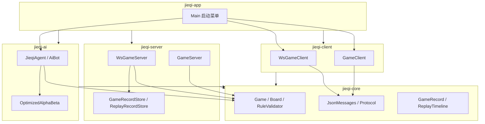
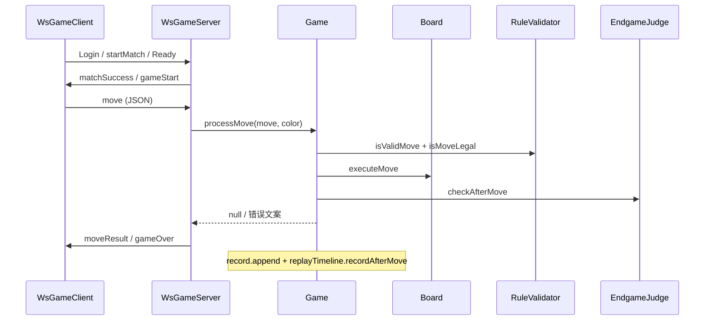
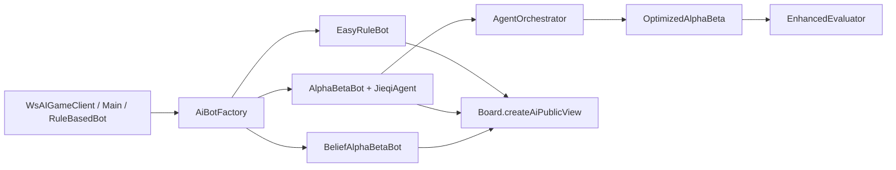
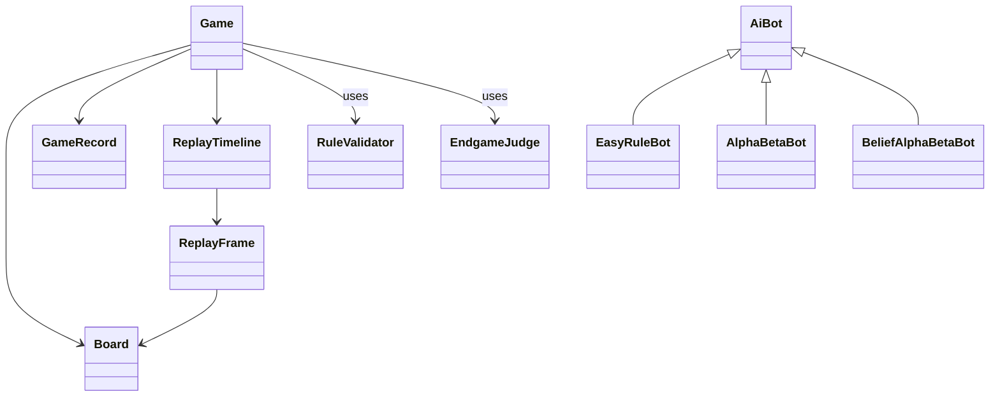

# 总体架构

> **Unveil** 揭棋对弈系统 · Maven 多模块  
> **关联**：[DOMAIN_MODEL.md](./DOMAIN_MODEL.md) · [RULE_ENGINE_DESIGN.md](./RULE_ENGINE_DESIGN.md) · [AI_DESIGN.md](./AI_DESIGN.md)

---

## 1. 模块依赖

**依赖方向**：`jieqi-core` 无外向依赖；`server` / `client` / `ai` 均依赖 `core`；`app` 聚合启动。

---

## 2. 模块职责表

| 模块 | 职责 | 不做什么 | 主要包 |
|------|------|----------|--------|
| **jieqi-core** | 棋盘、棋子、规则、终局、棋谱、JSON/TCP 协议模型 | 不含网络监听、不含 AI 搜索 | `com.jieqi.core`、`com.jieqi.record`、`com.jieqi.protocol` |
| **jieqi-server** | WebSocket/TCP 服务、房间、匹配、棋谱/复盘落盘 | 不重复实现规则（委托 `Game`） | `com.jieqi.server`、`com.jieqi.server.ws` |
| **jieqi-client** | 控制台交互、棋盘显示、命令解析 | 不做权威校验 | `com.jieqi.client` |
| **jieqi-ai** | 搜索、评估、三档 Bot、Agent 编排 | 不修改领域不变式 | `com.jieqi.ai`、`com.jieqi.ai.bot`、`com.jieqi.ai.agent` |
| **jieqi-app** | 统一菜单、CLI 参数路由 | 无新业务逻辑 | `com.jieqi.app` |

---

## 3. 对局主流程（WebSocket）

---

## 4. AI 调用流程

---

## 5. 核心类关系（简图）

---

## 6. 数据流：一步走子

| 阶段 | 组件 | 数据 |
|------|------|------|
| 1 请求 | `WsGameServer` | 解析 JSON → `Move` |
| 2 校验 | `Game.processMove` | 轮次、超时、翻子、规则 |
| 3 执行 | `Board.executeMove` | 更新 `grid`、翻子、吃子 |
| 4 记录 | `GameRecord` / `ReplayTimeline` | 文本行 + 棋盘快照帧 |
| 5 终局 | `EndgameJudge` | 更新 `status`、`gameOverReason` |
| 6 广播 | `JsonMessages.moveResult` | 双方/观战者同步 |
| 7 落盘 | 终局时 | `*.jieqi` + `*.replay.json` |

---

## 7. 部署视图

| 进程 | 端口 | 协议 |
|------|------|------|
| `WsGameServer` | 8887（默认） | WebSocket + JSON（课程主协议） |
| `GameServer` | 8888（可选） | TCP 文本帧附录 B |
| Docker Compose | 8887 映射 | 单容器 WS 服务 |

自检：`scripts/verify.ps1`（`mvn test` + compile + package）。

---

*深化自原 `docs/ARCHITECTURE.md`；与 [INTERFACE.typ](../INTERFACE.typ) 保持一致*
