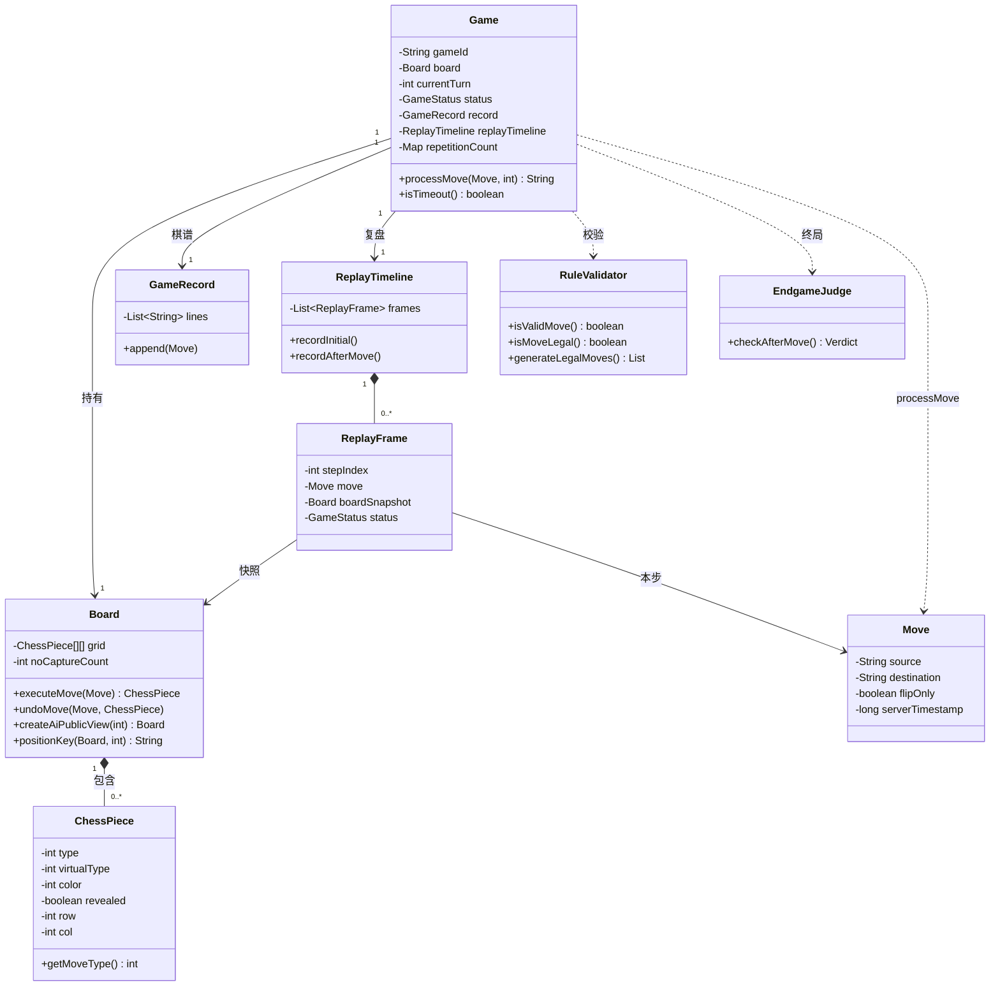
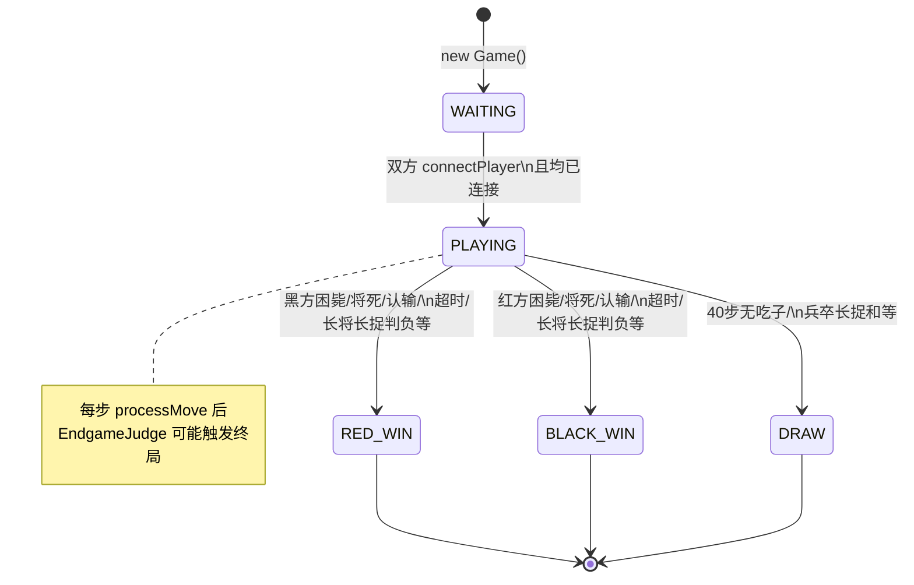

# 领域模型

> 揭棋对弈系统 **Unveil** · 技术设计文档  
> 实现位置：`jieqi-core` → `com.jieqi.core`、`com.jieqi.record`  
> 关联文档：[RULE_ENGINE_DESIGN.md](./RULE_ENGINE_DESIGN.md) · [ARCHITECTURE.md](./ARCHITECTURE.md)

---

## 1. 设计原则

| 原则 | 说明 |
|------|------|
| 领域与基础设施分离 | 棋盘、规则、对局状态在 `jieqi-core`；网络、持久化在 `jieqi-server` |
| 服务器权威 | 翻子随机、超时、终局以 `Game` + `Board` 为准 |
| 不可变复盘帧 | `ReplayFrame` 防御性拷贝，外部无法篡改历史 |
| 信息差显式建模 | `ChessPiece.revealed` / `createAiPublicView` 区分上帝视角与玩家视角 |

---

## 2. 核心领域类表

| 类 | 包 | 职责 | 关键字段 / 结构 |
|----|-----|------|-----------------|
| `Board` | `core` | 10×9 棋盘、走子/撤销、局面哈希 | `grid[10][9]`、`pieces`、`moveHistory`、`noCaptureCount` |
| `ChessPiece` | `core` | 棋子状态与坐标 | `type`、`virtualType`、`color`、`revealed`、`row`、`col` |
| `Move` | `core` | 走法值对象 | `source`、`destination`、`isFlipOnly`、`revealedType`、时间戳 |
| `Coordinate` | `core` | 坐标解析校验 | 显示坐标 ↔ 内部索引 |
| `Game` | `core` | 对局状态机、校验编排 | `board`、`currentTurn`、`status`、`record`、`replayTimeline` |
| `RuleValidator` | `core` | 走法规则（无状态工具类） | 静态方法 |
| `EndgameJudge` | `core` | 终局判定（无状态工具类） | `Verdict(status, reasonCode)` |
| `GameSummary` | `core` | 终局摘要 DTO | 胜负、原因、步数等 |
| `GameRecord` | `record` | 文字棋谱 | `lines: List<String>` |
| `MoveNotation` | `record` | 棋谱记法解析 | 文本 ↔ `Move` |
| `ReplayTimeline` | `record` | 复盘时间线 | `frames: List<ReplayFrame>` |
| `ReplayFrame` | `record` | 复盘单帧 | `stepIndex`、`move`、`boardSnapshot`、`status`… |
| `GameRecordStore` | `server` | 棋谱文件落盘 | `records/*.jieqi` |
| `ReplayRecordStore` | `server` | 复盘 JSON 落盘 | `records/*.replay.json` |

网络层 `WsRoom`、`ClientHandler` 等为**应用类**，不计入领域核心，但持有 `Game` 引用。

---

## 3. 类关系图

---

## 4. GameStatus 状态机

### 4.1 状态枚举

| 状态 | 含义 |
|------|------|
| `WAITING` | 等待双方连接 / 准备 |
| `PLAYING` | 对局进行中 |
| `RED_WIN` | 红方胜 |
| `BLACK_WIN` | 黑方胜 |
| `DRAW` | 和棋 |
| `TIMEOUT` | 超时终局（可合并到胜方 WIN，视调用路径） |

### 4.2 状态转换图

### 4.3 主要触发条件

| 转换 | 触发条件 | 检测位置 |
|------|----------|----------|
| WAITING → PLAYING | `redConnected && blackConnected` | `Game.connectPlayer` |
| PLAYING → RED_WIN | 黑方负（将死、超时、认输、长将等） | `EndgameJudge` / `processMove` / `disconnectPlayer` |
| PLAYING → BLACK_WIN | 红方负 | 同上 |
| PLAYING → DRAW | `noCaptureCount ≥ 80` 或兵卒长捉和 | `EndgameJudge` |
| PLAYING → *WIN (断线) | 一方 `disconnectPlayer` | `Game.disconnectPlayer` |

终局后 `isFinished()` 返回 `true`；不再接受 `processMove`。

---

## 5. 领域不变式（Invariants）

以下约束在正确实现中应始终成立：

| # | 不变式 | 说明 |
|---|--------|------|
| I1 | 格子唯一占用 | 棋盘上每个 `(row,col)` 最多一枚棋子；红黑不共格 |
| I2 | 回合交替 | `currentTurn` 只能是 `ChessPiece.RED` 或 `ChessPiece.BLACK` |
| I3 | 走子方匹配 | `processMove` 的 `playerColor` 必须等于 `currentTurn` |
| I4 | virtualType 不变 | 翻子只改 `type` 与 `revealed`；`virtualType` 保持开局原位角色 |
| I5 | 暗子 type | `revealed=false` 时 `type` 为 `UNKNOWN`（权威棋盘己方暗子除外服务器内部） |
| I6 | 无吃子计数 | `0 ≤ noCaptureCount ≤ 80`；吃子归零；翻子递增 |
| I7 | 复盘帧单调 | `ReplayTimeline.frames` 的 `stepIndex` 从 0 连续递增 |
| I8 | 开局帧唯一 | `recordInitial` 仅在 `frames` 为空时写入 stepIndex=0 |
| I9 | 棋谱追加顺序 | `GameRecord.lines` 顺序与实战走子顺序一致 |
| I10 | 重复计数 | 吃子后 `repetitionCount` 清空；和棋/将死前单调递增 |

违反不变式通常意味着 `Board.executeMove` / `undoMove` 未正确配对，或网络层绕过了 `Game.processMove`。

---

## 6. 值对象与实体

| 分类 | 类 | 理由 |
|------|-----|------|
| 实体 | `ChessPiece` | 有身份，在棋盘上移动 |
| 实体 | `Game` | 有 `gameId`，生命周期贯穿一局 |
| 值对象 | `Move` | 描述一次着法，可拷贝 |
| 值对象 | `ReplayFrame` | 不可变快照 |
| 服务 | `RuleValidator`、`EndgameJudge` | 无状态领域服务 |

---

## 7. Board 关键行为

| 方法 | 职责 | 不变式关联 |
|------|------|------------|
| `executeMove` | 移动/吃子/翻子 | I1、I4、I6 |
| `makeMove` / `unmakeMove` | 搜索用轻量快照 | 搜索后必须 unmake |
| `undoMove` | 完整撤销 | 恢复 I6 |
| `createAiPublicView` | 对手暗子脱敏 | I5（对手视角） |
| `positionKey` | 局面哈希 | I10 |
| `copy` / 拷贝构造 | 复盘快照、AI 分支 | 深拷贝棋子 |

---

## 8. Move 与时间戳

| 字段 | 来源 | 用途 |
|------|------|------|
| `turnStartTime` | 回合开始时服务器写入 | 步时计算 |
| `serverTimestamp` | `processMove` 时写入 | 棋谱、复盘 |
| `clientTimestamp` | 客户端可选 | 仅记录，不参与超时 |
| `revealedType` | 翻子后 | 广播真实翻开类型 |

---

## 9. 协议与领域映射

| 协议字段（JSON） | 领域对象 |
|------------------|----------|
| `fromX/fromY/toX/toY` | `Move.source/destination` |
| `board` 二维数组 | `Board.grid` |
| `piece.type` | `ChessPiece.type` |
| `piece.revealed` | `ChessPiece.revealed` |
| `gameOver.reason` | `EndgameJudge.ProtocolReason` |

映射实现：`BoardJsonMapper`、`JsonMessages`（`jieqi-core` / `protocol.json`）。

---

## 10. 测试覆盖

| 不变式 / 行为 | 测试类 | 状态 |
|---------------|--------|------|
| undo 配对 | `BoardUndoTest` | ✅ 已实现 |
| 局面哈希 | `BoardPositionKeyTest` | ✅ 已实现 |
| AI 公开视角 | `BoardAiPublicViewTest` | ✅ 已实现 |
| 复盘帧 | `ReplayTimelineTest`、`GameReplayTest` | ✅ 已实现 |
| 终局状态 | `GameEndgameTest` | ✅ 已实现 |

---

## 11. 已知限制

| 限制 | 说明 |
|------|------|
| `Game` 与网络耦合字段 | `redConnected` 等连接状态在 `Game` 内，非纯领域 | ⚡ 已实现-待强化 |
| 无领域事件 | 状态变更无 Event 发布，靠服务器轮询/回调 | 📋 规划中 |
| `GameRecordStore` 在 server 包 | 严格 DDD 可下沉接口到 core | 可接受 |

---

*文档版本：v1.0 · 2026-06-18 · 统计基准：5 Maven 模块 · 63 Java 文件（主代码） · ~7,540 LOC（`count-loc.ps1` 实测）*
