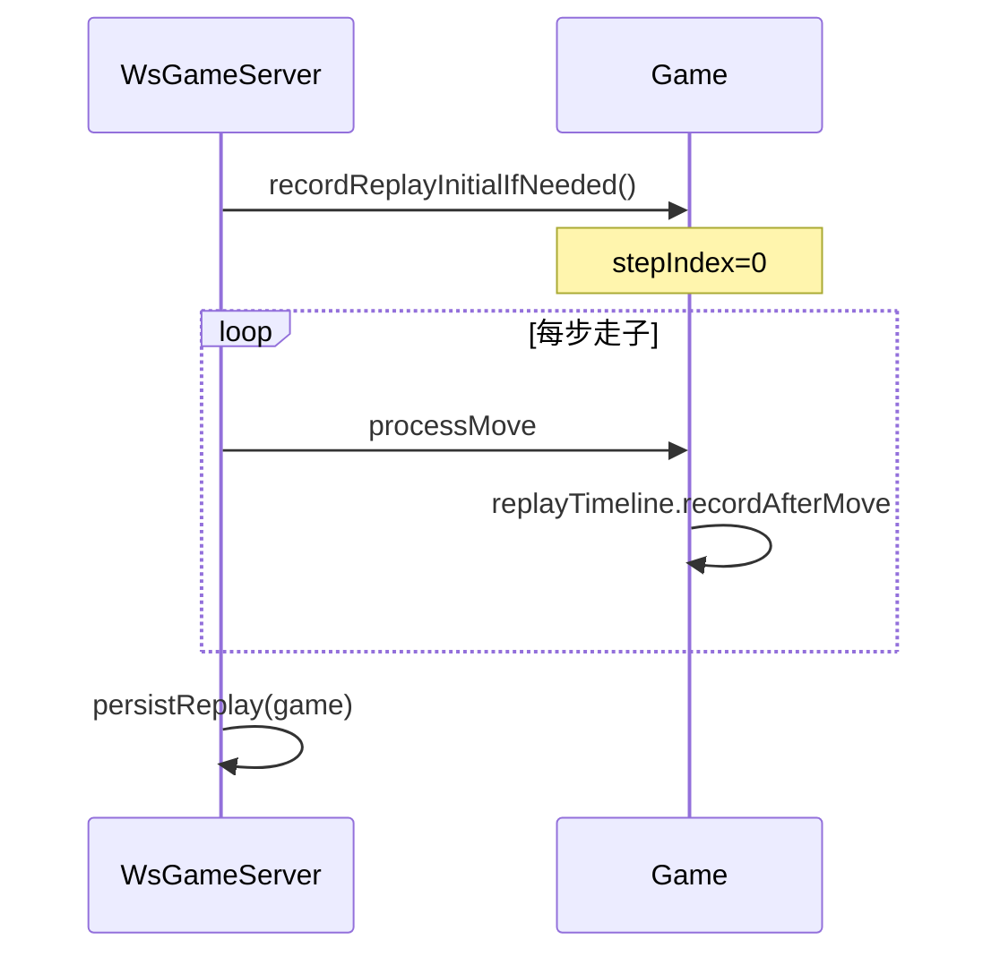

# 复盘设计

> **Unveil** · 棋谱与棋盘快照时间线  
> **实现指南**：`fupantasks.md`（内部） · **关联**：[DOMAIN_MODEL.md](./DOMAIN_MODEL.md) · [ARCHITECTURE.md](./ARCHITECTURE.md)

---

## 1. 为什么不能只用棋谱重走

| # | 原因 | 说明 |
|---|------|------|
| 1 | 翻子随机性 | 暗子真实 `type` 由服务器在翻开时确定，客户端重放无法复现相同随机结果 |
| 2 | 信息差 | 对局中客户端只见公开信息；纯 move 序列无法还原中间「真实棋盘」 |
| 3 | 非确定性 | 同一棋谱文本在不同环境重走，可能因翻子顺序不同导致分支局面不一致 |

**结论**：复盘必须保存**逐步棋盘快照**，而非仅保存走法文本。

---

## 2. 数据结构

### 2.1 ReplayFrame（单帧）

| 字段 | 类型 | 含义 |
|------|------|------|
| `stepIndex` | int | 帧序号：0=开局，n=第 n 步后 |
| `move` | Move | 导致本帧的走法（开局帧为 null） |
| `boardSnapshot` | Board | 该步后完整棋盘（防御性深拷贝） |
| `currentTurn` | int | 下一手方（RED/BLACK） |
| `status` | GameStatus | 对局状态 |
| `timestamp` | long | 服务器时间戳 |
| `captured` | ChessPiece | 本步被吃子（可 null） |

实现：`jieqi-core/.../record/ReplayFrame.java`（`getBoardSnapshot()` 每次返回新拷贝）。

### 2.2 ReplayTimeline

| 职责 | 说明 |
|------|------|
| 持有帧列表 | `List<ReplayFrame>` 有序追加 |
| `recordInitial` | 开局第 0 帧（仅首次） |
| `recordAfterMove` | 每步成功后追加 |
| `getFrame(i)` | 按索引读取（越界返回 null） |

实现：`jieqi-core/.../record/ReplayTimeline.java`。

### 2.3 Game 集成

```text
Game
 ├── record: GameRecord          # 文字棋谱
 └── replayTimeline: ReplayTimeline   # 快照时间线
```

- `recordReplayInitialIfNeeded()`：开局记第 0 帧  
- `processMove` 成功或终局时：`replayTimeline.recordAfterMove(...)`

---

## 3. 帧编号模型

```
stepIndex=0     开局（无 move）
stepIndex=1     第 1 手后
...
stepIndex=N     终局后最后一帧
```

`totalSteps`（协议字段）= 帧总数；客户端显示「步 k / N-1」时以 0 为开局。

---

## 4. 存储策略

| 层级 | 位置 | 生命周期 |
|------|------|----------|
| 内存 | `Game.replayTimeline` | 对局进行中 + 房间保留窗口内 |
| 文件 | `records/<gameId>.replay.json` | 终局 `persistReplay` 后持久化 |
| 文字棋谱 | `records/<gameId>.jieqi` | 并行落盘，供导出阅读 |

实现：`jieqi-server/.../ReplayRecordStore.java`。

---

## 5. 产生时机



---

## 6. WebSocket 协议（本组扩展）

| messageType | 方向 | 关键字段 |
|-------------|------|----------|
| `replayRequest` | C→S | `stepIndex`（可选，缺省为最新） |
| `replayFrame` | S→C | `roomId`, `stepIndex`, `totalSteps`, `currentTurn`, `status`, `board`, `move?`, `captured?` |

归属：**本组扩展**（见 `INTERFACE.typ` §本组扩展消息）。

---

## 7. 权限与视角

| 场景 | 棋盘显示 | 说明 |
|------|----------|------|
| 对局中复盘请求 | 按玩家视角脱敏 | 对手暗子不暴露真实 type |
| 终局后复盘 | 上帝视角（快照含真实身份） | `ReplayFrame` 存完整 Board |
| 非房间成员 | 拒绝 | 仅本局参与者可 `replayRequest` |

客户端：`WsGameClient` 复盘子命令 `n` / `p` / `g <步>` / `0` / `end` / `q`。

---

## 8. 测试覆盖

| 用例 | 测试类 |
|------|--------|
| 时间线追加与帧拷贝 | `ReplayTimelineTest` |
| Game 集成记录 | `GameReplayTest` |
| JSON 棋盘往返 | `BoardJsonMapperReplayTest` |
| WS 终局后 replayRequest | `WsGameServerIntegrationTest.replayRequestReturnsFramesAfterResign` |

---

## 9. 已知限制

- 房间销毁后仅能通过 `*.replay.json` 离线查看，无独立复盘服务器  
- 超大对局 JSON 体积随步数线性增长（未做增量压缩）  
- 观战者复盘权限未单独开放（📋 规划中）

---

*版本 v1.0 · 2026-06-18*
