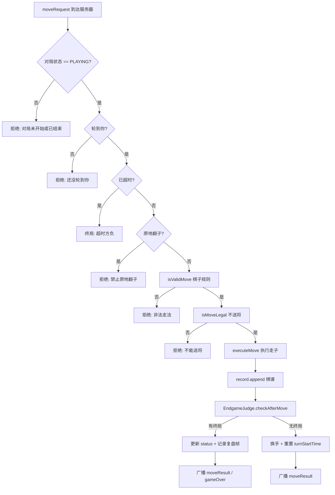

# 规则引擎设计

> 揭棋对弈系统 **Unveil** · 技术设计文档  
> 实现位置：`jieqi-core` → `com.jieqi.core.RuleValidator`、`EndgameJudge`、`Board`  
> 关联文档：[DOMAIN_MODEL.md](./DOMAIN_MODEL.md) · [ARCHITECTURE.md](./ARCHITECTURE.md)

---

## 1. 设计目标

| 目标 | 说明 | 状态 |
|------|------|------|
| 服务端权威校验 | 所有走子经 `Game.processMove` 统一入口判定 | ✅ 已实现 |
| 明暗子分离 | 暗子按 `virtualType` 走子，明子按 `type` 走子 | ✅ 已实现 |
| 强化士象 | 明士可出九宫、明象可过河 | ✅ 已实现 |
| 终局统一出口 | `EndgameJudge.checkAfterMove` 集中判定 | ✅ 已实现 |
| 错误原因细分 | `RuleValidator` 仅返回 boolean | ⚡ 已实现-待强化 |

规则校验在**服务器与领域层**执行；客户端可本地预检，但不作为终局依据。

---

## 2. 坐标系统

### 2.1 显示坐标（协议 / 用户界面）

列 `a`（左）→ `i`（右）；行 `9`（顶 / 黑方）→ `0`（底 / 红方）。

```
     a    b    c    d    e    f    g    h    i
   +----+----+----+----+----+----+----+----+----+
 9 |    |    |    |    |    |    |    |    |    |  黑方底线
 8 |    |    |    |    |    |    |    |    |    |
 7 |    |    |    |    |    |    |    |    |    |
 6 |    |    |    |    |    |    |    |    |    |
 5 |----+----+----+----+----+----+----+----+----|  河界
 4 |    |    |    |    |    |    |    |    |    |
 3 |    |    |    |    |    |    |    |    |    |
 2 |    |    |    |    |    |    |    |    |    |
 1 |    |    |    |    |    |    |    |    |    |
 0 |    |    |    |    |    |    |    |    |    |  红方底线
   +----+----+----+----+----+----+----+----+----+
```

### 2.2 内部数组索引

| 概念 | 规则 |
|------|------|
| 显示行 → 内部行 | `row = 9 - displayRow` |
| 显示列 → 内部列 | `col = coord.charAt(0) - 'a'` |
| 棋盘尺寸 | `grid[10][9]`，row 0 = 顶行（黑方），row 9 = 底行（红方） |
| 序列化 | `BOARD_STATE` 中 row0 = 顶行（黑方），row9 = 底行（红方） |

### 2.3 九宫范围

| 阵营 | 行范围（内部） | 列范围 |
|------|----------------|--------|
| 红帅 | 7–9 | 3–5（d–f 列） |
| 黑将 | 0–2 | 3–5（d–f 列） |

---

## 3. 棋子模型

### 3.1 类型编码

| 编码 | 棋子 | 红方名 | 黑方名 |
|------|------|--------|--------|
| 0 | KING | 帅 | 将 |
| 1 | ROOK | 车 | 车 |
| 2 | KNIGHT | 马 | 马 |
| 3 | CANNON | 炮 | 炮 |
| 4 | PAWN | 兵 | 卒 |
| 5 | ADVISOR | 仕 | 士 |
| 6 | BISHOP | 相 | 象 |
| -1 | UNKNOWN | 暗 | 暗 |

### 3.2 关键字段

| 字段 | 含义 |
|------|------|
| `type` | 真实身份；暗子未翻开时为 `UNKNOWN` |
| `virtualType` | 该格**开局原位**对应的象棋角色；暗子按此走子 |
| `revealed` | 是否已翻开 |
| `color` | `RED(0)` / `BLACK(1)` |
| `row`, `col` | 当前格子坐标（内部索引） |

`getMoveType()`：若 `revealed=false` 返回 `virtualType`，否则返回 `type`。

### 3.3 明子与暗子示例

| 场景 | type | virtualType | revealed | 走子依据 |
|------|------|-------------|----------|----------|
| 明车 | ROOK | ROOK | true | type = ROOK |
| 暗车（原位为车） | UNKNOWN | ROOK | false | virtualType = ROOK |
| 翻子后 | 服务器随机分配真实 type | 不变 | true | type（真实身份） |

翻子由 `Board.executeMove` 在服务器侧完成：`type` 从剩余子力池随机抽取，`revealed` 置 `true`，`virtualType` 保持不变。

---

## 4. 七种棋子走法规则

走法几何校验入口：`RuleValidator.isValidMove`。合法性（不送将）由 `isMoveLegal` / `generateStrictLegalMoves` 在试走后判定。

### 4.1 车 / 俥（ROOK）

| 项目 | 规则 |
|------|------|
| 移动 | 同行或同列直线移动 |
| 阻隔 | 路径上不得有棋子（吃子时可走到对方棋子格） |
| 明暗差异 | 无；暗车与明车几何规则相同 |
| 边界 | 不得走出棋盘（0≤row≤9，0≤col≤8） |

### 4.2 马 / 傌（KNIGHT）

| 项目 | 规则 |
|------|------|
| 移动 | 「日」字：`(±2,±1)` 或 `(±1,±2)` |
| 蹩马腿 | 马前进方向相邻格有子则不可跳 |
| 明暗差异 | 无 |
| 典型拒例 | 马在 `b7`，`b6` 有子则不可到 `d8` / `a8` |

### 4.3 炮 / 砲（CANNON）

| 项目 | 规则 |
|------|------|
| 平移 | 同行或同列，路径无子 |
| 吃子 | 路径上**恰好一个**炮架，再吃目标格棋子 |
| 明暗差异 | 无 |
| 典型拒例 | 两子之间有两个阻隔时不能吃 |

### 4.4 兵 / 卒（PAWN）

| 项目 | 规则 |
|------|------|
| 未过河 | 只能向对方前进 1 格（红方向上 row 减小，黑方向下 row 增大） |
| 已过河 | 红方 `row ≤ 4`、黑方 `row ≥ 5` 视为过河；可前进 1 或左右平移 1 |
| 后退 | 禁止 |
| 明暗差异 | 无 |

### 4.5 将 / 帅（KING）

| 项目 | 规则 |
|------|------|
| 移动 | 九宫内前后左右 1 格（曼哈顿距离 = 1） |
| 照面 | 两将同列且中间无子时，走子后若仍照面则 `isMoveLegal` 拒绝 |
| 明暗差异 | 将帅开局即为明子 |

### 4.6 士 / 仕（ADVISOR）

| 项目 | 暗子 | 明子（强化） |
|------|------|--------------|
| 移动 | 斜走 1 格 | 斜走 1 格 |
| 活动范围 | 限九宫 | **全场**（可出九宫） |
| 判定依据 | `!revealed` 时检查九宫 | `revealed` 时仅检查斜 1 格 |

### 4.7 象 / 相（BISHOP）

| 项目 | 暗子 | 明子（强化） |
|------|------|--------------|
| 移动 | 田字（行差 2、列差 2） | 同左 |
| 塞象眼 | 田字中心格有子则不可走 | 同左 |
| 过河 | **禁止**（红 `dst.row ≥ 5`，黑 `dst.row ≤ 4`） | **允许过河** |

---

## 5. 暗子特殊规则

| 规则 | 说明 | 校验位置 |
|------|------|----------|
| 走法按 virtualType | 暗子不暴露真实身份，仅按原位角色生成走法 | `getMoveType()` |
| 暗士限九宫 | 与标准象棋士相同 | `isValidAdvisorMove` |
| 暗象不过河 | 与标准象棋象相同 | `isValidBishopMove` |
| 禁止原地翻子 | `source == destination` 或 `isFlipOnly` 直接拒绝 | `Game.processMove` |
| 首次移动翻开 | 走子执行时 `revealed ← true`，`type` 由服务器随机 | `Board.executeMove` |
| 翻子不算吃子 | 无吃子目标的翻子仍递增 `noCaptureCount` | `Board.executeMove` |

暗子翻开后的真实 `type` 可能与 `virtualType` 不同——这是揭棋的核心不确定性来源。

---

## 6. 终局判定

终局入口：`EndgameJudge.checkAfterMove`，在 `Board.executeMove` 与棋谱记录之后调用。返回 `null` 表示继续对弈。

### 6.1 判定优先级（实现顺序）

```
吃子发生 → 清空 repetitionCount
    ↓
吃掉明将？ → 走子方胜（KING_CAPTURED）
    ↓
对方被将死？ → 走子方胜（CHECKMATE）
    ↓
对方困毙？ → 走子方胜（STALEMATE）
    ↓
noCaptureCount ≥ 80？ → 和棋（NO_CAPTURE_DRAW）
    ↓
更新 repetitionCount[boardHash]
    ↓
重复 ≥ 6 次？ → 长将判负 / 兵卒长捉和 / 长捉判负
    ↓
继续对弈
```

### 6.2 各终局类型详解

#### 将死（CHECKMATE）

| 条件 | 对方无合法走法 **且** 正在被将军 |
|------|----------------------------------|
| 检测 | `RuleValidator.isCheckmate(board, oppColor)` |
| 结果 | 走子方胜 |

#### 困毙（STALEMATE）

| 条件 | 对方无合法走法 **且** **未**被将军 |
|------|-------------------------------------|
| 检测 | `RuleValidator.isStalemate(board, oppColor)` |
| 结果 | 走子方胜（协议 reason = STALEMATE） |

#### 超时（TIMEOUT）

| 条件 | 当前回合已用时间 > 65 000 ms（60 s 步时 + 5 s 裕量） |
|------|------------------------------------------------------|
| 检测 | `Game.isTimeout()`，在 `processMove` 入口 |
| 结果 | 超时方负，对方胜；`GameStatus` 可能为 `TIMEOUT` 或胜方 WIN |

#### 认输

| 条件 | 玩家主动发送 `resign` 或断线（`disconnectPlayer`） |
|------|---------------------------------------------------|
| 检测 | 服务器 `WsRoom` / `GameServer` 层 |
| 结果 | 对方胜 |

#### 40 步无吃子和棋

| 条件 | `noCaptureCount ≥ 80`（双方各 40 步无吃子，翻子不计吃子） |
|------|----------------------------------------------------------|
| 检测 | `Board.getNoCaptureCount()` |
| 结果 | `GameStatus.DRAW`，reason = `NO_CAPTURE_DRAW` |

#### 长将判负

| 条件 | 同一局面（含行棋方）重复 ≥ 6 次，且当前步后仍在将军对方 |
|------|--------------------------------------------------------|
| 检测 | `repetitionCount` + `RuleValidator.isInCheck` |
| 结果 | 将军方（重复方）判负 |

#### 长捉判负 / 兵卒长捉和

| 条件 | 重复 ≥ 6 次，当前步未将军，但走子后可合法吃某一对方子（不含将） |
|------|----------------------------------------------------------------|
| 兵卒长捉 | 走子棋子为兵卒 → **和棋**（`REPETITION_DRAW`） |
| 其他长捉 | 走子方判负（`REPETITION_LOSS`） |

### 6.3 重复局面哈希

局面键：`Board.positionKey(board, sideToMove)`，用于长将/长捉计数。发生吃子时 `repetitionCount` 整体清空。

---

## 7. 校验流程

### 7.1 主流程（Mermaid）



### 7.2 两层校验职责

| 方法 | 职责 | 不检查 |
|------|------|--------|
| `isValidMove` | 几何走法、阵营、吃己方、棋子类型规则 | 是否送将 |
| `isMoveLegal` | 试走后己方是否被将军 | — |
| `generateStrictLegalMoves` | 枚举全部不送将的合法走法 | — |

### 7.3 将军检测

`isInCheck`：对方能否用合法几何走法吃到己方将帅（不考虑送将约束的 `generateAllMoves` + 目标为将）。

---

## 8. 与网络层交互

| 阶段 | 领域层 | 网络层 |
|------|--------|--------|
| 接收走子 | — | `WsGameServer` 解析 JSON → `Move` |
| 校验执行 | `Game.processMove` | — |
| 翻子结果 | `Board` 内部随机 | `moveResult.flipResult` 广播 |
| 终局 | `GameStatus` + `gameOverReason` | `gameOver` 消息 |
| 非法走子 | 返回错误字符串 | `error` 消息，棋盘不变 |

时间戳以服务器 `System.currentTimeMillis()` 为准；客户端时间戳仅记录，不参与超时判定。

---

## 9. 测试覆盖与状态

| 领域 | 测试类 | 状态 |
|------|--------|------|
| 七种走法 | `BoardMakeMoveTest`、`DarkPieceRuleTest` | ✅ 已实现 |
| 送将 / 照面 | `RuleEdgeCaseTest` | ✅ 已实现 |
| 将死 / 困毙 | `GameEndgameTest`、`EndgameJudgeTest` | ✅ 已实现 |
| 40 步无吃子 | `EndgameJudgeTest` | ✅ 已实现 |
| 长将 / 长捉 | `EndgameJudgeTest`、`RuleEdgeCaseTest` | ⚡ 已实现-待强化 |
| undo / 搜索模拟 | `BoardUndoTest` | ✅ 已实现 |

---

## 10. 已知限制

| 限制 | 说明 | 优先级 |
|------|------|--------|
| 错误原因不细分 | `RuleValidator` 返回 boolean，`processMove` 仅返回固定中文字符串 | P1 |
| 长捉分类简化 | 「将 / 杀 / 捉」的精确象棋裁判分类未完全实现；当前以「可合法吃子」近似「捉」 | P1 |
| 长捉边界 | 复杂连环捉、隔子捉等极端局面需人工复核 | P2 |
| 客户端本地校验 | 客户端可走同一套 `RuleValidator`，但与服务器版本必须同步 | — |
| 强化士象争议 | 已按课程/组内协议实现；与传统揭棋规则可能不一致 | — |

---

## 11. 相关代码索引

| 类 | 包 | 职责 |
|----|-----|------|
| `RuleValidator` | `com.jieqi.core` | 走法生成与合法性 |
| `EndgameJudge` | `com.jieqi.core` | 终局判定 |
| `Board` | `com.jieqi.core` | 执行走子、翻子、无吃子计数 |
| `Game` | `com.jieqi.core` | 校验编排、超时、状态机 |
| `ChessPiece` | `com.jieqi.core` | 棋子模型与坐标转换 |

---

*文档版本：v1.0 · 2026-06-18 · 统计基准：5 Maven 模块 · 63 Java 文件（主代码） · ~7,540 LOC（`count-loc.ps1` 实测）*
