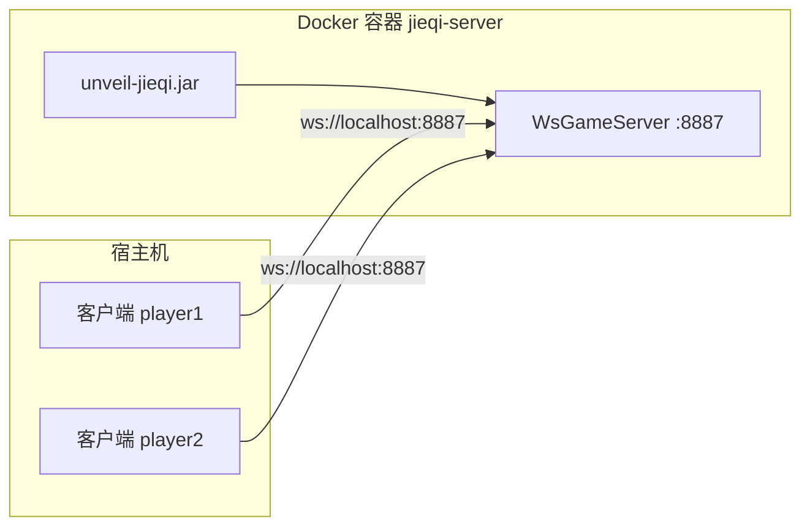

# Docker 部署指南

> **项目**：Unveil 揭棋对弈系统  
> **读者**：需要快速拉起服务器、无需本地安装 JDK/Maven 的验收方  
> **关联文档**：[BUILD_AND_RUN.md](./BUILD_AND_RUN.md) · [TROUBLESHOOTING.md](./TROUBLESHOOTING.md)

---

## 1. 概述

本项目提供基于 **Docker Compose** 的一键部署方案，默认启动 **WebSocket JSON 服务器**（课程公共接口，端口 **8887**）。  
TCP 附录 B 协议（端口 **8888**）在标准镜像中未一并暴露，需在宿主机本地运行或扩展 Compose 配置（见 §6）。



---

## 2. 前置条件

| 组件 | 版本建议 | 检查命令 |
|------|----------|----------|
| Docker Engine | 24+ | `docker --version` |
| Docker Compose | v2（`docker compose` 子命令） | `docker compose version` |
| 磁盘空间 | ≥ 2 GB（含 Maven 构建缓存层） | — |
| 端口 | 8887 未被占用 | `netstat -ano \| findstr 8887`（Windows） |

---

## 3. 仓库文件说明

| 文件 | 作用 |
|------|------|
| `Dockerfile` | 多阶段构建：Maven 21 编译 → JRE 21 运行 Fat JAR |
| `docker-compose.yml` | 定义 `jieqi-server` 服务与端口映射 |
| `jieqi-app/target/unveil-jieqi.jar` | 运行时入口（由 Dockerfile 内 `mvn package` 生成） |

### 3.1 Dockerfile 构建阶段摘要

| 阶段 | 基础镜像 | 动作 |
|------|----------|------|
| build | `maven:3.9.9-eclipse-temurin-21` | `mvn package -pl jieqi-app -am -DskipTests` |
| run | `eclipse-temurin:21-jre` | `java -jar unveil-jieqi.jar server-ws 8887` |

容器暴露端口：`EXPOSE 8887`。

### 3.2 docker-compose.yml 默认配置

```yaml
services:
  jieqi-server:
    build: .
    ports:
      - "${JIEQI_PORT:-8887}:8887"
    environment:
      JIEQI_PORT: "8887"
```

可通过环境变量 `JIEQI_PORT` 修改宿主机映射端口，例如 `JIEQI_PORT=9887 docker compose up`。

---

## 4. 构建与启动

### 4.1 一键构建并启动（推荐）

在仓库根目录执行：

```bash
docker compose up --build
```

| 参数 | 含义 |
|------|------|
| `--build` | 构建或重建镜像后再启动 |
| `-d` | 后台运行（可选） |
| `--force-recreate` | 强制重建容器（配置变更后） |

**预期日志**（节选）：

```
jieqi-server-1  | [WsGameServer] 监听 ws://0.0.0.0:8887
```

### 4.2 分步操作

```bash
# 仅构建镜像
docker compose build

# 后台启动
docker compose up -d

# 查看运行状态
docker compose ps
```

---

## 5. 端口映射说明

| 协议 | 容器内端口 | 宿主机默认端口 | 用途 | 标准 Compose 是否映射 |
|------|------------|----------------|------|------------------------|
| WebSocket + JSON | 8887 | 8887 | 课程公共接口、组间互操作 | ✅ 是 |
| TCP 文本帧 v2.0 | 8888 | 8888 | 附录 B 调试、兼容旧客户端 | ❌ 否（需本地或扩展） |

### 5.1 客户端连接 Docker 中的 WS 服务器

宿主机上运行客户端（需本地 JDK 21 + Maven，或已打包 JAR）：

```bash
mvn exec:java -f jieqi-app/pom.xml -am "-Dexec.args=client-ws ws://127.0.0.1:8887 player1 123456"
```

若客户端在另一台机器，将 `127.0.0.1` 替换为宿主机 IP，并确保防火墙放行 8887。

---

## 6. TCP 8888 端口（附录 B）

当前 `Dockerfile` 的 `ENTRYPOINT` 仅启动 `server-ws 8887`，**不包含 TCP 服务器**。  
如需在容器中同时提供 8888，可扩展 `docker-compose.yml`：

```yaml
services:
  jieqi-server:
    build: .
    ports:
      - "8887:8887"
      - "8888:8888"
    # 注：需修改 ENTRYPOINT 或增加第二个 service 运行 server 8888
```

**推荐做法**：Docker 仅部署 WS 8887；TCP 8888 在开发机本地运行：

```bash
mvn exec:java -f jieqi-app/pom.xml -am "-Dexec.args=server 8888"
```

---

## 7. 日志查看

```bash
# 前台运行时直接看终端输出

# 后台模式跟踪日志
docker compose logs -f jieqi-server

# 最近 100 行
docker compose logs --tail=100 jieqi-server
```

常见日志关键字：

| 关键字 | 含义 |
|--------|------|
| `监听 ws://` | 服务器就绪 |
| `新连接` | 客户端 WebSocket 握手成功 |
| `matchSuccess` | 匹配成功 |
| `gameOver` | 对局结束 |

棋谱与复盘文件默认写入容器内 `records/`；如需持久化，可在 Compose 中挂载卷：

```yaml
volumes:
  - ./records:/app/records
```

（具体工作目录以镜像内 `WORKDIR` 为准，联调时请确认路径。）

---

## 8. 停止与清理

```bash
# 停止容器（保留镜像）
docker compose down

# 停止并删除卷、网络
docker compose down -v

# 删除构建的镜像（释放磁盘）
docker compose down --rmi local
```

---

## 9. 与本地构建的对比

| 维度 | Docker Compose | 本地 `mvn exec:java` |
|------|----------------|----------------------|
| 环境依赖 | 仅需 Docker | JDK 21 + Maven 3.9+ |
| 构建时间 | 首次较慢（镜像层缓存后加快） | 依赖本机 `~/.m2` |
| 适用场景 | 验收机无 Java、快速演示服务器 | 开发调试、运行客户端与 AI |
| 协议支持 | 默认仅 WS 8887 | WS 8887 + TCP 8888 均可 |

---

## 10. 故障排查

详见 [TROUBLESHOOTING.md](./TROUBLESHOOTING.md)。Docker 特有问题：

| 现象 | 可能原因 | 处理 |
|------|----------|------|
| `port is already allocated` | 8887 被占用 | 改 `JIEQI_PORT` 或释放端口 |
| 构建失败 `BUILD FAILURE` | 网络无法拉取 Maven 依赖 | 配置 Docker 代理或重试 |
| 客户端连不上 | 用了 `ws://localhost` 但客户端在容器内 | 同一网络下用服务名或宿主机 IP |
| 容器启动后立即退出 | JAR 路径错误或端口绑定失败 | `docker compose logs` 查看堆栈 |

---

*文档版本：v1.0 · 2026-06-18 · Unveil 第一组*
