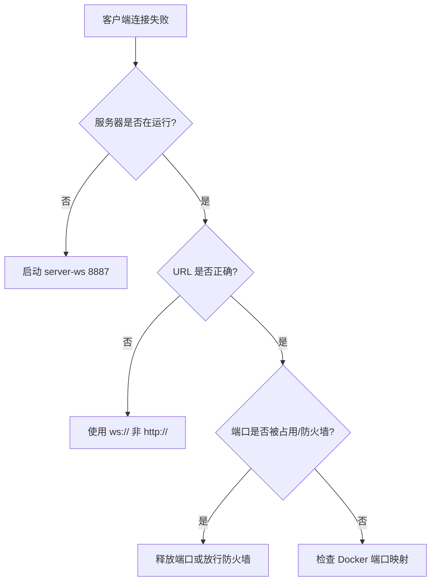

# 常见问题排查

> **项目**：Unveil 揭棋对弈系统  
> **读者**：开发者、验收联调人员  
> **关联文档**：[BUILD_AND_RUN.md](./BUILD_AND_RUN.md) · [DOCKER_DEPLOYMENT.md](./DOCKER_DEPLOYMENT.md)

---

## 1. 问题速查表

| # | 问题现象 | 可能原因 | 解决方案 |
|---|----------|----------|----------|
| 1 | 启动服务器报 `Address already in use` / 端口被占用 | 上次服务器进程未关闭，或其他程序占用 8887/8888 | Windows：`netstat -ano \| findstr 8887` 查 PID，`taskkill /PID <pid> /F`；Linux/macOS：`lsof -i :8887` 后 `kill` |
| 2 | 客户端 `Connection refused` / 连接失败 | 服务器未启动、地址或端口错误、防火墙拦截 | 确认服务器日志有「监听」；URL 必须为 `ws://127.0.0.1:8887`（不是 `http://`）；检查防火墙 |
| 3 | `mvn` 编译报 `release version 21 not supported` | `JAVA_HOME` 指向 JDK 17 或更低 | 安装 JDK 21，设置 `JAVA_HOME`，`mvn -version` 确认 Java 21 |
| 4 | 运行报 `Unsupported class file major version` | 用 JDK 17 运行了 JDK 21 编译的 class | `java -version` 必须为 21；IDE 项目 SDK 同步为 21 |
| 5 | `verify.ps1` 失败退出 | 单元测试未通过或编译错误 | 单独运行 `mvn test`，查看 `target/surefire-reports/` 中失败用例 XML |
| 6 | AI 走子超时 / 长时间无响应 | 搜索深度过大、时间预算不足、机器负载高 | 人机模式选 Easy；检查 `AiConfig` 时间预算；关闭其他占用 CPU 的程序 |
| 7 | 双方棋盘不同步 | 客户端未正确处理 `moveResult`；网络丢包后状态漂移 | 以服务器 `moveResult` 为准更新本地棋盘；非法着法仅发送方收到 `valid=false` |
| 8 | 非法走法未被拒绝 | 在本地模式测试而非服务器模式；或绕过了 `Game.processMove` | 网络对弈必须以服务器校验为准；用 WS 客户端发明显非法着法验证 |
| 9 | `mvn exec:java` 行为与预期不符（旧逻辑） | 本地 `~/.m2` 缓存旧 SNAPSHOT | 执行 `mvn install -pl jieqi-app -am -DskipTests` 或直接用 Fat JAR |
| 10 | Docker 容器启动后客户端连不上 | 端口未映射、连接地址错误、容器已退出 | `docker compose ps`；`docker compose logs`；确认 `8887:8887` 映射 |
| 11 | 复盘 `replay` 无响应 | 对局未结束就请求；房间已清理 | 仅在 `gameOver` 后使用；确认 `records/<roomId>.replay.json` 是否存在 |
| 12 | 匹配后无法开局 | 双方未 `ready`；先手窗口内未发 `first` | 双方依次 `match` → `ready` → `first true/false` |
| 13 | Maven 下载依赖极慢或失败 | 网络或镜像源问题 | 配置国内 Maven 镜像；Docker 构建时配置代理 |
| 14 | `demo.ps1` 窗口闪退 | Maven 未安装、路径错误、首次构建失败 | 先手动在根目录执行 `mvn compile`；查看弹窗内错误信息 |
| 15 | 组间联调消息格式不一致 | 混用 TCP 与 WebSocket；`messageType` 大小写错误 | 统一使用 `docs/INTERFACE.typ` v3.0；WS 用 `Login`/`startMatch` 等规范字段名 |

---

## 2. 分类详解

### 2.1 网络与端口

**检查清单**：

- [ ] 服务器终端无异常退出
- [ ] 客户端 URL 含 `ws://` 协议头
- [ ] 端口号与服务器一致（默认 8887）
- [ ] 同一台机器联调使用 `127.0.0.1` 而非错误 hostname

### 2.2 构建与 JDK

| 检查项 | 命令 | 期望 |
|--------|------|------|
| Java 运行时版本 | `java -version` | 21.x |
| Maven 使用的 JDK | `mvn -version` | Java version: 21 |
| JAVA_HOME | `echo $env:JAVA_HOME`（PS） | 指向 JDK 21 根目录 |
| 父 POM 编译级别 | 查看根 `pom.xml` | `maven.compiler.release=21` |

### 2.3 测试失败

1. 运行 `mvn test -pl jieqi-core` 定位规则类失败。
2. 运行 `mvn test -pl jieqi-ai` 定位 AI 类失败。
3. 打开 `jieqi-*/target/surefire-reports/TEST-*.xml` 查看 `<failure>` 节点。
4. 修复后重新执行 `powershell -File scripts/verify.ps1`。

### 2.4 AI 相关

| 现象 | 说明 | 建议 |
|------|------|------|
| Medium 思考 5s+ | 迭代加深至预算耗尽 | 属正常；验收可改用 Easy |
| Hard 棋力不如 Medium | Belief 采样次数过多导致单次搜索过浅 | 已调参：约 24 次搜索/步（见 AI 设计文档） |
| AI 走出非法着法 | 搜索回滚不完整或 fallback 失效 | 查看 `AiBot` 最终是否经 `generateLegalMoves` 校验 |

### 2.5 协议与互操作

- **权威规范**：`docs/INTERFACE.typ` v3.0，冲突时以 Typst 为准。
- **公共消息**：`Login`、`startMatch`、`Ready`、`move`、`gameStart`、`moveResult`、`gameOver`。
- **本组扩展**：`replayRequest`、`replayFrame`、`rematchRequest` 等，联调前与对方确认是否支持。
- **不可混用**：同一对局中不能一端 WS、一端 TCP。

---

## 3. 日志与诊断命令

| 目的 | 命令 |
|------|------|
| 查看 WS 服务器日志 | 服务器终端输出 / `docker compose logs -f` |
| 全量测试 | `mvn test` |
| 单模块测试 | `mvn test -pl jieqi-core` |
| 编译不测试 | `mvn compile` |
| 检查端口占用（Windows） | `netstat -ano \| findstr 8887` |
| 检查端口占用（Linux） | `ss -tlnp \| grep 8887` |
| 协议 PDF | `typst compile docs/INTERFACE.typ docs/INTERFACE.pdf` |

---

## 4. 获取帮助

| 资源 | 路径 |
|------|------|
| 构建运行 | [BUILD_AND_RUN.md](./BUILD_AND_RUN.md) |
| 消息示例 | [../03-interface/MESSAGE_EXAMPLES.md](../03-interface/MESSAGE_EXAMPLES.md) |
| 复盘设计 | [../02-design/REPLAY_DESIGN.md](../02-design/REPLAY_DESIGN.md) |
| 答辩 Q&A | [../07-presentation/DEFENSE_QA.md](../07-presentation/DEFENSE_QA.md) |

---

*文档版本：v1.0 · 2026-06-18 · Unveil 第一组*
