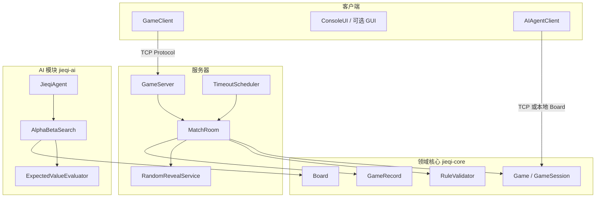

# 揭棋对弈系统 — 架构与目录结构

> 大作业：揭棋对弈程序设计 | 项目代号：**Unveil**  
> 本文档为**目标目录结构**与模块划分，供小组迭代开发与实验报告引用。

## 1. 需求分层（与作业对齐）

| 层次 | 内容 | 验收要点 |
|------|------|----------|
| 业务规则 | 明暗子、翻子、强化士象、40步无吃子和、长将长捉 | `RuleValidator` + `EndgameJudge` |
| 对弈核心 | 棋盘、走子、棋谱、随机翻子 | `Board`、`Move`、`GameRecord` |
| 网络对弈 | TCP、双客户端、非法着法拒绝、服务器计时 | `GameServer`、`Protocol` |
| AI 博弈 | 期望值评估、Alpha-Beta、Agent | `JieqiAgent`、`ExpectedValueEvaluator` |
| 非功能 | 多盘对弈（可选）、组间互操作协议 | `MatchRoom`、`docs/INTERFACE.md` |

## 2. 系统架构（Mermaid）



## 3. 当前仓库目录结构（已实现）

```
Unveil/
├── pom.xml
├── README.md
├── .gitignore
├── docs/
│   ├── REQUIREMENTS.md
│   ├── ARCHITECTURE.md
│   ├── INTERFACE.md
│   └── TEAM.md
├── jieqi-core/
│   └── src/main/java/com/jieqi/
│       ├── core/          Board, ChessPiece, Move, Game, RuleValidator
│       ├── protocol/      Protocol（组间 TCP 消息格式）
│       ├── ui/            ConsoleUI
│       └── record/        GameRecord
├── jieqi-server/
│   └── src/main/java/com/jieqi/server/
│       ├── GameServer.java
│       └── ClientHandler.java
├── jieqi-client/
│   └── src/main/java/com/jieqi/client/GameClient.java
├── jieqi-ai/
│   └── src/main/java/com/jieqi/ai/   # Alpha-Beta、评估、AIVsAI 等
└── jieqi-app/
    └── src/main/java/com/jieqi/app/Main.java
```

源码根路径统一为各模块下的 `src/main/java/`（Maven 标准布局）。

## 4. 领域类清单（满足「至少 5 个领域类」）

| 类名 | 职责 |
|------|------|
| `Board` | 10×9 棋盘、执行走子、暗明状态 |
| `ChessPiece` | 棋子颜色、类型、是否翻开 |
| `Move` | source/destination/type/turnStartTime |
| `GameSession`（或 `Game`） | 回合、胜负、超时、重复局面 |
| `GameRecord` | 服务器自动棋谱记录 |
| `Coordinate` | 坐标解析与校验 |
| `PieceType` | 类型枚举与作业 type 编码 |

网络层 `ClientHandler`、`MatchRoom` 为**应用/基础设施类**，不计入领域类，但属于 OOP 分层。

## 5. 现有代码 → 目标位置映射

| 当前路径 | 建议归属 |
|----------|----------|
| `core/Board.java` | `jieqi-core/.../domain/Board.java` |
| `core/ChessPiece.java` | `domain/ChessPiece.java` |
| `core/Move.java` | `domain/Move.java` |
| `core/Game.java` | `domain/GameSession.java` |
| `core/RuleValidator.java` | `rules/RuleValidator.java` |
| `network/GameServer.java` | `jieqi-server/.../GameServer.java` |
| `network/GameClient.java` | `jieqi-client/.../GameClient.java` |
| `network/Protocol.java` | 保留；与 `docs/INTERFACE.md` 同步 |
| `ai/*` | `jieqi-ai/...` 按 search/eval/agent 分子包 |
| `ui/ConsoleUI.java` | `jieqi-client/.../ui/` |
| `MainEnhanced.java` | `jieqi-app/.../Main.java` |

## 6. 迭代任务拆分（人机协作 / AI 辅助）

按作业推荐工作流，建议顺序：

1. **需求** — 完善 `docs/REQUIREMENTS.md`，向老师确认不明规则  
2. **核心** — `Coordinate` + `Notation` + `Move` 单元测试  
3. **规则** — `RuleValidator` / `MoveGenerator` / 翻子-only 回合  
4. **棋谱** — `GameRecord` 服务器落盘或内存列表  
5. **服务器** — `RandomRevealService`、超时、`MatchRoom`  
6. **客户端** — 连接、禁非法着、显示己方在下  
7. **协议** — 冻结 `INTERFACE.md`，与其他组联调  
8. **AI** — 期望值评估 → Alpha-Beta → `JieqiAgent`  
9. **集成测试** — 双客户端对战、AI vs AI 报告胜负  
10. **报告** — `TEAM.md` + `REPORT.md`  

## 7. 依赖关系

```
jieqi-app  →  jieqi-server, jieqi-client, jieqi-ai
jieqi-server, jieqi-client, jieqi-ai  →  jieqi-core
jieqi-ai  →  jieqi-core only（不依赖 server）
```

## 8. 与作业强制项对照

- [x] 面向对象，≥5 领域类（见第 4 节）  
- [x] TCP Socket、Move 三属性 + 时间戳  
- [x] 服务器随机翻子 type（`RandomRevealService`）  
- [x] 棋谱自动记录（`GameRecord` + `GameRecordStore` 落盘 `records/`）  
- [x] 超时（服务器时间为准，+5s 裕量可配置）  
- [x] AI：Alpha-Beta + 暗子期望评估（已有雏形）  
- [ ] 40 步无吃子和、长将长捉细则与 `EndgameJudge` 对齐老师规则  
- [ ] 多盘对弈（`MatchRoom` + `gameId` 已有基础）  
- [x] 组间互操作：遵守 `INTERFACE.md`（§13 自检已勾选）  
