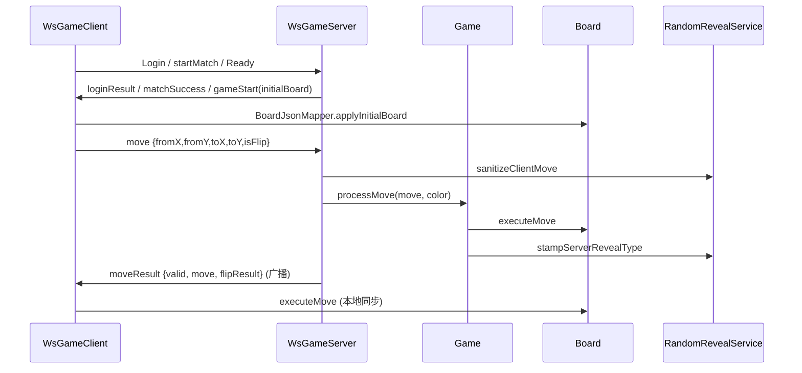
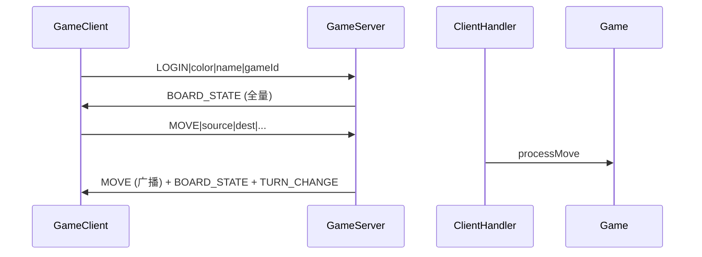

# Unveil 代码全景与老师规范迁移方案

> **文档性质**：只读规划文档，描述当前仓库全部代码结构、与老师 2026 公共接口（WebSocket + JSON）的对照关系，以及**如何在不破坏领域核心的前提下**用老师规范替换/收敛现有实现。  
> **版本**：2026-05-29  
> **分支背景**：`feat/teacher-websocket-protocol` 已实现 WS 主路径，TCP v2.0 仍保留为附录 B。  
> **约束**：本文档**不修改任何源码**；实施时须先更新 `docs/INTERFACE.typ`，再改代码。

---

## 目录

1. [执行摘要](#1-执行摘要)
2. [仓库与构建体系](#2-仓库与构建体系)
3. [模块依赖与数据流](#3-模块依赖与数据流)
4. [jieqi-core 逐文件说明](#4-jieqi-core-逐文件说明)
5. [jieqi-server 逐文件说明](#5-jieqi-server-逐文件说明)
6. [jieqi-client 逐文件说明](#6-jieqi-client-逐文件说明)
7. [jieqi-ai 逐文件说明](#7-jieqi-ai-逐文件说明)
8. [jieqi-app 与入口脚本](#8-jieqi-app-与入口脚本)
9. [测试与 CI 覆盖图](#9-测试与-ci-覆盖图)
10. [双协议并存现状（TCP v2.0 vs WebSocket JSON v3.0）](#10-双协议并存现状)
11. [老师规范逐条对照表](#11-老师规范逐条对照表)
12. [差距与不一致清单](#12-差距与不一致清单)
13. [替换策略：保留 / 迁移 / 废弃 / 新建](#13-替换策略)
14. [分阶段实施计划（建议）](#14-分阶段实施计划)
15. [文件级替换映射表](#15-文件级替换映射表)
16. [风险、开放问题与验收标准](#16-风险开放问题与验收标准)

---

## 1. 执行摘要

### 1.1 项目是什么

**Unveil** 是北京邮电大学「揭棋对弈程序设计」大作业第一组的 Maven 多模块 Java 21 项目。核心能力：

- **揭棋规则引擎**（明暗子、虚拟类型走法、翻子、终局判定）
- **网络真人对弈**（当前存在两套传输层）
- **AI 博弈**（Alpha-Beta + 暗子期望值 + 多 Agent 编排）
- **控制台 UI**（无 GUI）

### 1.2 当前「双协议」状态

| 协议 | 端口 | 地位 | 主要类 |
|------|------|------|--------|
| **WebSocket + JSON** | 8887 | 课程公共接口 / `INTERFACE.typ` v3.0 **正文** | `WsGameServer`, `WsGameClient`, `com.jieqi.protocol.json.*` |
| **TCP 文本帧 v2.0** | 8888 | 本组历史扩展 / `INTERFACE.typ` **附录 B** | `GameServer`, `GameClient`, `Protocol` |

两套协议**共用** `jieqi-core` 领域层（`Board`, `Game`, `RuleValidator`, `RandomRevealService` 等），**不共用**匹配模型、账号模型、传输帧格式。

### 1.3 迁移结论（一句话）

> **领域层不动；传输与匹配层以老师 WS JSON 为唯一组间互操作面；TCP 栈降级为可选附录或逐步归档；AI 与 DevOps 需补 WS 适配。**

### 1.4 已完成 vs 待完成（相对老师规范）

| 类别 | 状态 |
|------|------|
| 老师列出的全部 `messageType` | 已实现 |
| 暗子随机 + 服务器权威翻子 | 已实现 |
| Login / Match / Ready / gameStart 流程 | 已实现 |
| move / moveResult / flipResult | 已实现 |
| 超时 timeout + gameOver | 已实现 |
| 错误码 1001–4001 | 已实现 |
| WS 集成测试（move/resign/终局/超时） | 部分实现：仅 2 场景 |
| AI 接入 WS | 未实现 `EnhancedAIEngine` 仍连 TCP 8888 |
| Docker / compose 默认端口 | 未实现 仍暴露 8888 TCP |
| 客户端单元/集成测试 | 未实现 `jieqi-client` 零测试 |
| 按玩家视角的棋盘迷雾（Per-client board） | 部分实现：未实现；当前客户端本地 `executeMove` 全知 |

---

## 2. 仓库与构建体系

### 2.1 顶层目录树

```
Unveil/
├── pom.xml                     # 父 POM：5 子模块、JDK 21、Gson/WebSocket 版本管理
├── README.md                   # 构建与运行（含 WS/TCP 双路径）
├── CLAUDE.md                   # AI 协作约束、协议优先级
├── Dockerfile                  # Fat JAR；默认 ENTRYPOINT: TCP server 8888
├── docker-compose.yml          # 映射 8888（TCP）
├── .github/workflows/ci.yml    # test → compile → package
├── scripts/
│   ├── run-app.ps1             # package + java -jar（推荐 Windows 启动）
│   └── verify.ps1              # 监工自检：test + compile + package
├── docs/                       # 需求、架构、协议、本迁移文档
├── jieqi-core/                 # 领域 + 双协议 + UI + 棋谱
├── jieqi-server/               # TCP + WS 双服务端
├── jieqi-client/               # TCP + WS 双客户端
├── jieqi-ai/                   # 搜索、评估、Agent、本地/网络 AI
└── jieqi-app/                  # Main 菜单 + Fat JAR 入口
```

### 2.2 Maven 模块与 artifactId

| 模块 | artifactId | packaging | 说明 |
|------|------------|-----------|------|
| 根 | `unveil-parent` | pom | 聚合 |
| 核心 | `jieqi-core` | jar | 无第三方运行时依赖（除 gson） |
| 服务端 | `jieqi-server` | jar | 依赖 core + Java-WebSocket |
| 客户端 | `jieqi-client` | jar | 依赖 core + Java-WebSocket |
| AI | `jieqi-ai` | jar | 仅依赖 core |
| 应用 | `jieqi-app` | jar | 依赖全部；assembly → `unveil-jieqi.jar` |

### 2.3 第三方依赖（父 POM `dependencyManagement`）

| 依赖 | 版本 | 用途 |
|------|------|------|
| `org.java-websocket:Java-WebSocket` | 1.5.7 | 老师示例指定 |
| `com.google.code.gson:gson` | 2.10.1 | 老师示例指定 |
| `org.junit.jupiter:junit-jupiter` | 5.11.4 | 测试 |

**无 Spring Boot、无数据库**；WS 账号 `UserRegistry`、TCP 匹配 `MatchmakingService` 均为内存实现。

### 2.4 构建与运行命令（现状）

```bash
# 编译全模块
mvn compile

# 交互菜单（须 -f 指向 jieqi-app 并 -am 构建依赖）
mvn exec:java -f jieqi-app/pom.xml -am

# Fat JAR（推荐）
mvn package -pl jieqi-app -am -DskipTests
java -jar jieqi-app/target/unveil-jieqi.jar server-ws 8887

# 协议 PDF
typst compile docs/INTERFACE.typ docs/INTERFACE.pdf
```

---

## 3. 模块依赖与数据流

### 3.1 依赖关系（编译时）

```
jieqi-app
  ├── jieqi-server
  ├── jieqi-client
  ├── jieqi-ai
  └── jieqi-core

jieqi-server ──► jieqi-core
jieqi-client ──► jieqi-core
jieqi-ai     ──► jieqi-core
```

`jieqi-ai` **不依赖** server/client，可独立用于本地对弈与性能测试。

### 3.2 运行时数据流（WebSocket 主路径）



**关键点**：WS 路径**没有**每步 `BOARD_STATE` 全量同步；客户端在收到合法 `moveResult` 后本地 `board.executeMove(move)`。这与 TCP 路径不同。

### 3.3 运行时数据流（TCP 附录 B）



TCP 依赖 `Protocol.buildBoardState` 每步推送完整棋盘字符串，客户端 `Protocol.applyBoardState`。

---

## 4. jieqi-core 逐文件说明

`jieqi-core` 是整个项目的**迁移锚点**：无论采用哪套传输协议，此模块应**最大幅度保留**。

### 4.1 包 `com.jieqi.core` — 领域模型与规则

| 文件 | 行量级 | 职责详解 |
|------|--------|----------|
| `Board.java` | ~390 | 10×9 网格；`initBoard()` 随机分配 15 枚暗子类型；`POSITION_VIRTUAL_TYPES` 定义每位虚拟类型；`executeMove` 处理移动/吃子/翻子-only；维护 `moveHistory`、`noCaptureCount`；提供局面字符串哈希、`getExpectedValue` 供 AI |
| `ChessPiece.java` | ~100 | 颜色 RED/BLACK；类型 0–6（将帅车马炮兵士象）；`revealed` 标志；`virtualType`；坐标转换 `fromCoord`/`toCoord`；子力价值 |
| `Coordinate.java` | ~30 | 外部坐标 `a0`–`i9` ↔ 内部 `row=9-displayRow`, `col=file-'a'` |
| `Move.java` | ~50 | source, destination, type, turnStartTime, client/server timestamp, isFlipOnly；`isTimeout()` 65s |
| `Game.java` | ~140 | 对局状态机 PLAYING/RED_WIN/BLACK_WIN/DRAW；currentTurn；turnStartTime；`processMove` 调用 RuleValidator + EndgameJudge；重复局面计数；**不**拦截送将 |
| `RuleValidator.java` | ~250+ | 揭棋全部走法合法性：暗子按 virtualType、明士象过河强化、马腿象眼炮架；`generateLegalMoves`；将军/将死/困毙 |
| `EndgameJudge.java` | ~120 | 走子后终局：吃将、将死、困毙、40 回合无吃子(80 半步)、长将/长捉(6 次哈希)、兵卒长捉和 |
| `RandomRevealService.java` | ~30 | `sanitizeClientMove` 清除客户端 type；`stampServerRevealType` 走子后以棋盘真实类型写回 Move |

**与老师规范的关系**：规则层**与传输无关**；`RandomRevealService` 直接对应老师「服务器决定 flipResult、客户端不可伪造 type」。

### 4.2 包 `com.jieqi.protocol` — TCP v2.0（附录 B）

| 文件 | 职责 |
|------|------|
| `Protocol.java` | MSG 1–10、REASON 0–9、ERR 100–202；`buildMessage` 帧格式 `msgType\|len\|payload`；BOARD_STATE/MOVE 序列化 |
| `FrameDecoder.java` | 字节缓冲粘包/半包解码 |
| `ProtocolReader.java` | InputStream 上读完整帧 |

**迁移建议**：组间联调以 WS 为准时，此包标记 **deprecated**，保留供调试与他组 TCP 互操作；**不删除**直至老师明确废弃附录 B。

### 4.3 包 `com.jieqi.protocol.json` — 老师 WS JSON

| 文件 | 职责 |
|------|------|
| `JsonMessageTypes.java` | 全部 C→S / S→C `messageType` 字符串常量 |
| `JsonMessages.java` | Gson 解析/构建；`parseMove`/`moveToJson`；`loginResult`/`gameStart`/`moveResult`/`gameOver`/`error` 工厂方法；Protocol REASON → JSON reason 字符串桥接 |
| `JsonErrorCodes.java` | 1001–4001 |
| `BoardJsonMapper.java` | `Board` ↔ `initialBoard` JSON 数组 `{x,y,piece,visible}` |
| `PieceJsonMapper.java` | 内部 type 0–6 ↔ JSON 名 `king`/`rook`/…；`red`/`black` |

**迁移建议**：此包为**长期主协议层**；新增消息类型只在此扩展，并同步 `INTERFACE.typ`。

### 4.4 包 `com.jieqi.record` — 棋谱

| 文件 | 职责 |
|------|------|
| `MoveNotation.java` | 记法 `source-dest(type)[翻]` 格式化与解析 |
| `GameRecord.java` | 行列表、导出 `.jieqi` 文本、从 Board 加载 |

### 4.5 包 `com.jieqi.ui` — 控制台 UI

| 文件 | 职责 |
|------|------|
| `ConsoleUI.java` | ASCII 棋盘；红方 ANSI 着色；可选上一步源/目标 `*` 高亮；**当前无 per-player 迷雾** |

---

## 5. jieqi-server 逐文件说明

### 5.1 TCP 栈（附录 B）

| 文件 | 职责 |
|------|------|
| `GameServer.java` | `ServerSocket` 8888；线程池；`ConcurrentHashMap` 存 Game；超时轮询线程；广播；结束时 `GameRecordStore.save` |
| `ClientHandler.java` | 每 TCP 连接：LOGIN、MOVE、DRAW_REQUEST、RESIGN、CHAT、QUIT；调用 `RandomRevealService`；广播 BOARD_STATE |
| `MatchmakingService.java` | 空 gameId 自动撮合；指定 gameId 加入；新建房间 |
| `GameRecordStore.java` | 写入 `records/{gameId}.jieqi` |

### 5.2 WebSocket 栈（老师规范）

| 文件 | 职责 |
|------|------|
| `WsGameServer.java` | 继承 `WebSocketServer`；处理全部 JsonMessageTypes；`matchQueue` + `WsRoom`；10s 先手协商窗口；65s 步时轮询；断线判负 |
| `WsRoom.java` | 双玩家、Ready 状态、颜色分配、先手、`Game` 实例 |
| `WsPlayerContext.java` | 单连接：userId、roomId、color、ready、wannaFirst |
| `UserRegistry.java` | 内存 register/login；Login 可 auto-create（开发便利） |

### 5.3 WS 消息处理映射（WsGameServer）

| messageType | 处理函数 | 行为摘要 |
|-------------|----------|----------|
| `Login` | `handleLogin` | 校验/自动注册 → `loginResult` |
| `register` | `handleRegister` | 显式注册 |
| `startMatch` | `handleStartMatch` | 入队；两人配对 → `matchSuccess` + 建 `WsRoom` |
| `cancelMatch` | `handleCancelMatch` | 出队（部分清理） |
| `requestFirstHand` | `handleRequestFirstHand` | 10s 窗口内记录 wannaFirst |
| `Ready` | `handleReady` | 双方 Ready → `gameStart` + `initialBoard` |
| `move` | `handleMove` | `Game.processMove` → `moveResult` 广播 |
| `ping` | inline | → `pong` |
| `Resign` | `handleResign` | → `gameOver` reason=resign |

---

## 6. jieqi-client 逐文件说明

| 文件 | 协议 | 职责 |
|------|------|------|
| `GameClient.java` | TCP | Socket 8888；FrameDecoder 读帧；LOGIN 选色/房间；交互走子 draw/chat/resign；`Protocol.applyBoardState` 同步 |
| `WsGameClient.java` | WS | WebSocketClient；Login → match → ready → move；`handleMoveResult` 本地 `executeMove`；命令行 REPL |

**共同依赖**：`ConsoleUI` 显示棋盘。

**迁移缺口**：

- 无 `PlayerBoardView`：收到 `moveResult` 后对**对方**刚翻开的子，当前直接显示真实类型（与老师「双方 visible=true」一致，但与 Q1 未来「被吃方不可见」扩展冲突）
- 零测试

---

## 7. jieqi-ai 逐文件说明

### 7.1 搜索与评估

| 文件 | 职责 |
|------|------|
| `OptimizedAlphaBeta.java` | 迭代加深 Alpha-Beta；置换表；杀手/历史启发；暗子期望分支 |
| `EnhancedEvaluator.java` | 子力 + 位置 + 机动 + 将安全 + 威胁 + 兵形 + 暗子期望 |
| `TranspositionTable.java` | EXACT/LOWER/UPPER 节点缓存 |
| `ZobristHash.java` | AI 搜索用 Zobrist（**未**用于 Game 长将哈希） |
| `KillerHeuristic.java` / `HistoryHeuristic.java` | 着法排序 |

### 7.2 Agent 编排（作业要求）

| 文件 | 职责 |
|------|------|
| `JieqiAgent.java` | 对外统一 `selectMove(board, color, timeLimitMs)` |
| `AgentOrchestrator.java` | ProbabilityAgent → EndgameAgent → SearchAgent |
| `ProbabilityAgent.java` | 暗子池概率偏差 |
| `EndgameAgent.java` | 子力≤12 加深搜索 |
| `SearchAgent.java` | 默认 Alpha-Beta 决策 |

### 7.3 运行入口

| 文件 | 模式 | 网络 |
|------|------|------|
| `EnhancedAIEngine.java` | TCP 网络 AI | 连 `127.0.0.1:8888`，读 BOARD_STATE，发 MOVE |
| `AIVsAIEnhanced.java` | 本地双 AI | 无网络 |
| `PerformanceTest.java` | 基准测试 | 无网络 |

**迁移关键**：需新建 `WsAIEngine` 或重构 `EnhancedAIEngine` 为传输无关的 `NetworkAIAdapter` 接口，实现 WS 版。

---

## 8. jieqi-app 与入口脚本

### 8.1 `Main.java` 菜单

| 选项 | 调用 | 协议 |
|------|------|------|
| 1 | `GameServer` | TCP 8888 |
| 2 | `GameClient` | TCP |
| 3 | `AIVsAIEnhanced.runMatch` | 本地 |
| 4 | `playVsAI` | 本地 Board + `EnhancedAIEngine.calculateMove` |
| 5 | `PerformanceTest` | 本地 |
| 6 | `runLocalTest` | 本地双人 |
| 7 | `WsGameServer` | WS 8887 |
| 8 | `WsGameClient` | WS |

### 8.2 CLI 子命令

```
server [port]              → TCP GameServer
client [host port name]    → TCP GameClient
server-ws [port]           → WsGameServer
client-ws [url user pass]  → WsGameClient
```

### 8.3 脚本

| 脚本 | 行为 |
|------|------|
| `scripts/run-app.ps1` | `mvn package -pl jieqi-app -am -DskipTests` → `java -jar unveil-jieqi.jar` |
| `scripts/verify.ps1` | `mvn test` (core+server+ai) + compile + package |

---

## 9. 测试与 CI 覆盖图

### 9.1 单元测试（jieqi-core，19 类）

覆盖：坐标、暗子规则、吃将、BOARD_STATE 同步、RandomReveal、EndgameJudge、FrameDecoder、Protocol 序列化、BoardJsonMapper、棋谱记法。

### 9.2 服务端集成测试

| 套件 | 数量 | 协议 |
|------|------|------|
| `GameServer*IntegrationTest` | 9 | TCP |
| `WsGameServerIntegrationTest` | 1 类 2 场景 | WS |

WS 测试现状：login → match → ready → gameStart；ping → pong。**缺少**：move 合法/非法、resign、timeout、gameOver、disconnect。

### 9.3 AI 测试（6 类）

JieqiAgent、Evaluator、Orchestrator、ProbabilityAgent、EndgameAgent。

### 9.4 CI（`.github/workflows/ci.yml`）

```
mvn test -pl jieqi-core,jieqi-server,jieqi-ai
mvn compile
mvn package -pl jieqi-app -am -DskipTests
```

**未跑** client 测试（不存在）。

---

## 10. 双协议并存现状

### 10.1 功能对照矩阵

| 能力 | TCP v2.0 | WS JSON v3.0 | 老师规范 |
|------|----------|--------------|----------|
| 传输 | TCP 文本帧 `\n` | WebSocket 文本 JSON | WS |
| 端口 | 8888 | 8887 | 8887 |
| 登录 | LOGIN 消息 | Login + loginResult | Login |
| 匹配 | gameId 撮合 | startMatch 队列 | startMatch |
| 准备/开局 | 登录后自动 | Ready → gameStart | Ready |
| 走子 | MOVE | move → moveResult | move |
| 翻子揭示 | MOVE.type | flipResult | flipResult |
| 棋盘同步 | 每步 BOARD_STATE | 仅 initialBoard + 客户端本地 | initialBoard + moveResult |
| 提和 | DRAW_REQUEST | 未实现 | 未实现 未定义 |
| 聊天 | CHAT | 未实现 | 未实现 未定义 |
| 认输 | RESIGN | Resign | Resign |
| 超时 | 服务器轮询 | timeout + gameOver | timeout |
| 心跳 | 未实现 | ping/pong | 可选 |
| 错误码 | 100–202 | 1001–4001 | 1001–4001 |

### 10.2 重复实现（迁移时可抽象）

| 概念 | TCP 实现 | WS 实现 | 建议 |
|------|----------|---------|------|
| 对局逻辑 | ClientHandler → Game | WsGameServer.handleMove → Game | **已共用 Game** |
| 翻子权威 | RandomRevealService | RandomRevealService | 保持 |
| 棋谱落盘 | GameRecordStore | GameRecordStore | 保持 |
| 超时轮询 | GameServer 线程 | WsGameServer.timeoutLoop | 可抽 `TimeoutScheduler` |
| 匹配 | MatchmakingService | matchQueue + WsRoom | 可抽 `MatchService` 接口 |
| 断线处理 | ClientHandler.onDisconnect | WsGameServer.handleDisconnect | 可统一 `DisconnectPolicy` |

### 10.3 不应合并的部分

- **帧格式**：TCP `Protocol` vs JSON `JsonMessages` — 保持两个 Adapter
- **客户端状态同步策略**：TCP 全量 BOARD_STATE vs WS 增量 moveResult

---

## 11. 老师规范逐条对照表

权威来源：`docs/_teacher_interface.md`（原始）+ `docs/INTERFACE.typ` v3.0（组内扩展）。

### 11.1 传输与依赖

| 老师要求 | 本仓库实现 | 文件 |
|----------|------------|------|
| WebSocket + JSON | 已实现 | `WsGameServer`, `WsGameClient` |
| 端口 8887 | 已实现（默认） | `WsGameServer`, Main `server-ws` |
| Java-WebSocket 1.5.7 | 已实现 | 父 pom |
| Gson 2.10.1 | 已实现 | 父 pom |

### 11.2 客户端 → 服务器消息

| messageType | 实现 | 备注 |
|-------------|------|------|
| Login | 已实现 | userId/password |
| register | 已实现 | |
| startMatch | 已实现 | FIFO 队列 |
| cancelMatch | 已实现 | 基础出队 |
| requestFirstHand | 已实现 | 10s 窗口 |
| Ready | 已实现 | 双方 Ready 开局 |
| move | 已实现 | fromX/Y, toX/Y, isFlip |
| ping | 已实现 | |
| Resign | 已实现 | 注意大小写 `Resign` |

### 11.3 服务器 → 客户端消息

| messageType | 实现 | 备注 |
|-------------|------|------|
| loginResult | 已实现 | success, userId, message |
| matchSuccess | 已实现 | roomId, opponentId, opponentNickname |
| roomInfo | 已实现 | opponentReady |
| gameStart | 已实现 | red/blackPlayerId, yourColor, firstHand, initialBoard |
| moveResult | 已实现 | success, valid, move, flipResult? |
| timeout | 已实现 | loserId, winnerId, reason |
| gameOver | 已实现 | winner, reason, winnerId |
| pong | 已实现 | |
| error | 已实现 | code, message |

### 11.4 数据结构

| 结构 | 实现 | 文件 |
|------|------|------|
| initialBoard `{x,y,piece,visible}` | 已实现 | `BoardJsonMapper` |
| piece 枚举 rook/knight/… | 已实现 | `PieceJsonMapper` |
| move 坐标 fromX/fromY/toX/toY | 已实现 | `JsonMessages.parseMove` |
| flipResult 服务器生成 | 已实现 | `RandomRevealService` + `WsGameServer.handleMove` |
| 错误码 1001–4001 | 已实现 | `JsonErrorCodes` |

### 11.5 流程（老师 §4）

```
Login → startMatch → matchSuccess → Ready×2 → gameStart
→ move ↔ moveResult → gameOver | timeout
```

本仓库 `WsGameServerIntegrationTest` 已覆盖主干；`requestFirstHand` 在 `firstHandLoop` 中处理。

---

## 12. 差距与不一致清单

### 12.1 与老师规范的功能差距

| # | 差距 | 严重度 | 说明 |
|---|------|--------|------|
| G1 | WS 集成测试不足 | 高 | 联调前需补 move/终局/超时自动化 |
| G2 | AI 仅 TCP | 中 | 作业 F12「可对接网络」在 WS 下未验证 |
| G3 | Docker 默认 TCP 8888 | 中 | 与 README 主路径 WS 矛盾 |
| G4 | 无主动 10s 客户端 ping 线程 | 低 | 老师写「可选」 |
| G5 | cancelMatch 房间清理不完整 | 低 | 极端场景可能残留 room |
| G6 | 无 capability 协商 | 低 | 未知 messageType 直接 4001 |

### 12.2 文档/代码命名不一致

| 项 | 文档 | 代码 |
|----|------|------|
| 期望值评估类名 | `ExpectedValueEvaluator` | `Board.getExpectedValue` + `EnhancedEvaluator` + `ProbabilityAgent` |
| 架构图 MatchRoom | ARCHITECTURE.md | 实际为 `MatchmakingService` / `WsRoom` |
| INTERFACE.typ 附录编号 | 封面写附录 C 为 TCP | 正文附录 B 为 TCP |

### 12.3 信息可见性（规则层面，非传输 bug）

- 老师：暗子走第一步后 `visible=true`，**双方客户端**收到 flipResult
- 用户曾疑问「对方走了不应看到真实类型」— 按标准揭棋与对方翻开规则，**应可见**；仅 Q1「被吃暗子类型对被吃方是否隐藏」仍待老师裁定

---

## 13. 替换策略

### 13.1 四层模型

```
┌─────────────────────────────────────────┐
│  L4 入口层：jieqi-app, scripts, Docker   │  ← 改默认 server-ws:8887
├─────────────────────────────────────────┤
│  L3 传输层：WS JSON (主) / TCP (附录)    │  ← TCP 降级，WS 增强测试
├─────────────────────────────────────────┤
│  L2 会话层：匹配、账号、房间、超时        │  ← 抽象接口，WS 为默认实现
├─────────────────────────────────────────┤
│  L1 领域层：jieqi-core                   │  ← **不替换，只增强**
└─────────────────────────────────────────┘
```

### 13.2 保留（不删不改语义）

| 组件 | 理由 |
|------|------|
| `Board`, `ChessPiece`, `Move`, `Coordinate` | 规则与 AI 基石 |
| `RuleValidator`, `EndgameJudge` | 作业强制规则 |
| `Game`, `RandomRevealService` | 双协议已共用 |
| `GameRecord`, `MoveNotation`, `GameRecordStore` | 棋谱要求 |
| `com.jieqi.protocol.json.*` | 老师规范主协议 |
| `WsGameServer` 及 ws 包 | 已实现主路径 |
| `ConsoleUI` | UI 要求；可增迷雾模式 |
| 全部 jieqi-core 测试 | 回归保障 |

### 13.3 迁移（改默认、补测试、统一 DevOps）

| 现状 | 目标 |
|------|------|
| Main 菜单 1–2 为 TCP 首选 | 菜单重排：7–8（WS）置顶或合并为「网络对弈」 |
| Dockerfile ENTRYPOINT `server 8888` | 改为 `server-ws 8887`，EXPOSE 8887 |
| docker-compose 8888 | 8887 |
| `EnhancedAIEngine` TCP-only | 新增 `WsAIClient` 或抽象 `GameTransport` |
| WS 测试 2 场景 | 补齐至与 TCP 9 场景对等（能 WS 测的不走 TCP） |
| README/CLAUDE 双轨说明 | WS 单一主路径 + 附录 B 链接 |

### 13.4 废弃/归档（联调稳定后）

| 组件 | 策略 |
|------|------|
| `GameServer`, `ClientHandler` | 标记 `@Deprecated`，移入 `server.legacy` 包或独立 module `jieqi-server-tcp` |
| `GameClient` | 同上 |
| `Protocol`, `FrameDecoder`, `ProtocolReader` | 保留在 core，文档标注附录 B |
| TCP 集成测试 | 保留 CI 但降为 optional profile `-Ptcp-legacy` |

**不建议立即物理删除**：他组可能仍用 TCP 调试；删除前需 `INTEROP.md` 交叉验证表确认。

### 13.5 新建（尚未存在）

| 新组件 | 用途 |
|--------|------|
| `WsAIEngine` / `WsGameClient` AI 模式 | AI 经 WS 接入对战 |
| `PlayerBoardView` | 若 Q1 裁定「被吃方不可见 type」，在客户端过滤显示 |
| `MatchService` 接口 | 统一 TCP/WS 匹配语义（长期） |
| `WsGameServerIntegrationTest` 扩展 | move/resign/timeout/gameOver/disconnect |
| `WsGameClientTest` | 客户端 JSON 解析与本地 sync |

---

## 14. 分阶段实施计划

### 阶段 0：文档冻结（已完成大部分）

- [x] `INTERFACE.typ` v3.0 正文 = WS JSON
- [x] 附录 B = TCP v2.0
- [x] `_teacher_interface.md` 归档
- [ ] 本迁移文档评审通过后作为实施依据

### 阶段 1：DevOps 与入口统一（低风险，1–2 人日）

1. `Dockerfile` / `docker-compose.yml` → 8887 + `server-ws`
2. `Main.java` 菜单文案：默认推荐 WS
3. `README.md` / `CLAUDE.md` 与脚本一致
4. CI 增加：`mvn test` 含 `WsGameServerIntegrationTest` 全绿

**不删 TCP**；菜单仍保留选项 1–2 供调试。

### 阶段 2：WS 测试补全（中风险，2–3 人日）

新增测试类（建议）：

| 测试 | 验证点 |
|------|--------|
| `WsMoveIntegrationTest` | 合法 move → moveResult.valid=true + flipResult |
| `WsIllegalMoveTest` | 非法 move → error 2001 |
| `WsResignTest` | Resign → gameOver reason=resign |
| `WsTimeoutTest` | 模拟超时（可调 Game turnStartTime） |
| `WsDisconnectTest` | 断线 → 对方 gameOver disconnect |

### 阶段 3：AI 接入 WS（中风险，2–4 人日）

```
方案 A（推荐）：新建 WsAIEngine extends WebSocketClient
  - Login → startMatch → Ready
  - onMessage: gameStart → 存 Board
  - onMessage: moveResult → executeMove → 若轮到我则 JieqiAgent.selectMove → send move

方案 B：抽象 NetworkTransport 接口
  - TcpTransport (现有 EnhancedAIEngine)
  - WsTransport (新建)
  - JieqiAgent 不变
```

`Main` 增加选项「AI 经 WS 对战」或 CLI `ai-ws ws://... user pass`。

### 阶段 4：会话层抽象（3–5 人日）

- 抽 `com.jieqi.server.session.GameSessionManager`
- TCP `MatchmakingService` 与 WS `matchQueue` 实现同一接口
- 减少 `WsGameServer` 与 `GameServer` 重复超时/断线代码

### 阶段 5：TCP _legacy 归档（联调后）

- 移动至 `jieqi-server-legacy` 模块或 `-Plegacy` profile
- `INTEROP.md` 声明：2026 联调默认 WS-only
- 保留 9 个 TCP 测试在 legacy profile

---

## 15. 文件级替换映射表

### 15.1 老师规范 → 现有实现（「已替换完成」部分）

| 老师概念 | 本仓库位置 | 状态 |
|----------|------------|------|
| JsonWebSocketServer 示例 | `WsGameServer` | 已替换示例桩 |
| JsonWebSocketClient 示例 | `WsGameClient` | 已替换 |
| initialBoard | `BoardJsonMapper.toInitialBoard` | 已实现 |
| move JSON | `JsonMessages.parseMove` | 已实现 |
| moveResult + flipResult | `WsGameServer.handleMove` | 已实现 |
| Login/Register | `UserRegistry` + handlers | 已实现 |
| 错误码 | `JsonErrorCodes` | 已实现 |

### 15.2 若「完全以老师规范为唯一网络面」时的替换关系

| 原 TCP 路径 | 替换为 WS 路径 | 领域层 |
|-------------|----------------|--------|
| `GameServer.start()` | `WsGameServer.start()` | 共用 `Game` |
| `GameClient.start()` | `WsGameClient.startInteractive()` | 共用 `Board` |
| `Protocol.buildLoginMsg` | `JsonMessages` Login 对象 | — |
| `Protocol.buildMessage(MSG_MOVE,...)` | move JSON | — |
| `Protocol.applyBoardState` | `board.executeMove` + 可选 future `boardSnapshot` 消息 | — |
| `MatchmakingService` (gameId) | `startMatch` 队列 | 不同语义，**不能 1:1 替换** |
| `EnhancedAIEngine` (TCP) | `WsAIEngine`（待建） | 共用 `JieqiAgent` |
| Main 选项 1–2 | Main 选项 7–8 或合并 | — |
| Dockerfile `server 8888` | `server-ws 8887` | — |

### 15.3 明确「不替换」的文件

```
jieqi-core/src/main/java/com/jieqi/core/*.java     # 全部保留
jieqi-core/.../RuleValidator.java
jieqi-core/.../EndgameJudge.java
jieqi-core/.../RandomRevealService.java
jieqi-ai/.../JieqiAgent.java
jieqi-ai/.../OptimizedAlphaBeta.java
jieqi-ai/.../AgentOrchestrator.java
```

---

## 16. 风险、开放问题与验收标准

### 16.1 风险

| 风险 | 缓解 |
|------|------|
| 他组仍用 TCP | 保留附录 B 至联调结束；INTEROP 表记录 |
| WS 客户端本地 sync 与服务器状态漂移 | 增加可选 `boardSnapshot` 扩展消息（需 INTERFACE.typ） |
| 删除 TCP 导致回归 | legacy profile + 保留测试 |
| AI 改 WS 引入新 bug | 先 WsAI 集成测试，再改 Main |

### 16.2 开放问题（INTERFACE.typ Q1–Q44 摘录）

实施迁移时**不必等待**全部裁定，但以下影响客户端显示/广播策略：

| 编号 | 问题 | 对迁移影响 |
|------|------|------------|
| Q1 | 吃暗子被吃方是否知 type | 若裁定隐藏 → 需 `PlayerBoardView` + 双通道 moveResult |
| Q3 | 40 回合 = 80 半步 | 已实现，文档对齐即可 |
| Q14–Q20 | 断线重连、多盘 | WS 未实现重连，列为 v3.1 |
| Q21–Q24 | AI 接入方式 | 阶段 3 WsAIEngine |

### 16.3 迁移完成验收标准（建议）

- [ ] 默认 `docker compose up` 启动 WS 8887，两客户端可 match→ready→对弈至 gameOver
- [ ] `mvn test` 中 WS 集成测试 ≥ 6 场景全绿
- [ ] `JieqiAgent` 可通过 WS 与真人或 AI 对战完成一局
- [ ] `docs/INTERFACE.typ` 与代码 messageType 零 diff
- [ ] `INTEROP.md` 至少 1 组外校 WS 联调记录
- [ ] README 主路径无 TCP 8888 误导

---

## 附录 A：完整 Java 源文件索引（81 个）

### jieqi-core（19 main + 19 test）

**main**: `Board`, `ChessPiece`, `Coordinate`, `Move`, `Game`, `RuleValidator`, `EndgameJudge`, `RandomRevealService`, `Protocol`, `FrameDecoder`, `ProtocolReader`, `JsonMessageTypes`, `JsonMessages`, `JsonErrorCodes`, `BoardJsonMapper`, `PieceJsonMapper`, `GameRecord`, `MoveNotation`, `ConsoleUI`

**test**: `CoordinateTest`, `ChessPieceCoordTest`, `DarkPieceRuleTest`, `KingCapturedRuleTest`, `BoardExpectedValueTest`, `BoardSyncTest`, `RandomRevealServiceTest`, `EndgameJudgeTest`, `GameEndgameTest`, `FrameDecoderTest`, `ProtocolMoveSerializationTest`, `ProtocolFrameIntegrationTest`, `BoardJsonMapperTest`, `GameRecordTest`, `GameRecordImportTest`, `MoveNotationParseTest`

### jieqi-server（8 main + 12 test）

**main**: `GameServer`, `ClientHandler`, `MatchmakingService`, `GameRecordStore`, `WsGameServer`, `WsRoom`, `WsPlayerContext`, `UserRegistry`

**test**: `AbstractGameServerIntegrationTest`, `GameRecordStoreTest`, `MatchmakingServiceTest`, `GameServerLoginIntegrationTest`, `GameServerMoveIntegrationTest`, `GameServerTurnChangeIntegrationTest`, `GameServerIllegalMoveIntegrationTest`, `GameServerResignIntegrationTest`, `GameServerDrawIntegrationTest`, `GameServerChatIntegrationTest`, `GameServerUnknownMsgIntegrationTest`, `WsGameServerIntegrationTest`

### jieqi-client（2 main）

`GameClient`, `WsGameClient`

### jieqi-ai（16 main + 6 test）

**main**: `JieqiAgent`, `AgentOrchestrator`, `AgentContext`, `JieqiSubAgent`, `ProbabilityAgent`, `EndgameAgent`, `SearchAgent`, `OptimizedAlphaBeta`, `EnhancedEvaluator`, `TranspositionTable`, `ZobristHash`, `KillerHeuristic`, `HistoryHeuristic`, `EnhancedAIEngine`, `AIVsAIEnhanced`, `PerformanceTest`

**test**: `JieqiAgentTest`, `EnhancedEvaluatorTest`, `AgentOrchestratorTest`, `ProbabilityAgentTest`, `EndgameAgentTest`

### jieqi-app（1 main）

`Main`

---

## 附录 B：与现有文档的关系

| 文档 | 与本迁移文档关系 |
|------|------------------|
| `INTERFACE.typ` / `INTERFACE.md` | 协议权威；实施前必须先改 |
| `_teacher_interface.md` | 老师原始规范源 |
| `ARCHITECTURE.md` | 架构概览；部分类名已过时，以本文为准 |
| `REQUIREMENTS.md` | 需求覆盖度 |
| `INTEROP.md` | 联调 checklist |
| `TEACHER_WS_PROTOCOL.md` | 已合并至 INTERFACE v3.0 |
| `TASKS.md` / `REPORT.md` | 分工与报告引用本文「阶段计划」 |

---

*文档作者：基于 Unveil 仓库全量代码阅读与 `feat/teacher-websocket-protocol` 分支状态整理。*  
*实施时请遵循 CLAUDE.md：接口先行 → 测试 → 实现 → 规范提交。*
