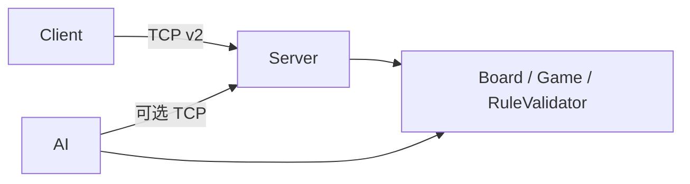

# 揭棋对弈程序 — 实验报告

**项目代号**：Unveil  
**课程**：揭棋对弈程序设计（大作业）  
**协议版本**：公共通信协议 v2.0  

## 1. 小组与分工

见 [TEAM.md](./TEAM.md)。共 4 人：张恒基（组长）、秦博宇、陈艺博、陈雨飞。

## 2. 需求与实现范围

| 类别 | 内容 | 实现位置 |
|------|------|----------|
| 网络对弈 | 双客户端 TCP、非法着法拒绝、服务器计时 | `jieqi-server` / `jieqi-client` |
| 棋谱 | source/destination/type、服务器记录 | `GameRecord`、`GameRecordStore` |
| 翻子 | 服务器权威 type | `RandomRevealService` |
| AI | 期望值 + Alpha-Beta + 多 Agent | `jieqi-ai` |
| 互操作 | 帧格式、消息类型、原因码 | `docs/INTERFACE.md` / `.typ` |

## 3. 系统架构

采用 Maven 五模块：`jieqi-core`（领域+协议）、`jieqi-server`、`jieqi-client`、`jieqi-ai`、`jieqi-app`。  
详见 [ARCHITECTURE.md](./ARCHITECTURE.md)。



## 4. 关键技术

### 4.1 TCP 粘包与半包

协议帧：`msgType|payloadByteLength|payload\n`。  
实现 `FrameDecoder` 累积字节缓冲，按 `\n` 切行并校验 UTF-8 字节长度；`ProtocolReader` 供 server/client/AI 阻塞读帧。避免仅用 `readLine()` 在分包场景下解析错误。

### 4.2 服务器权威翻子

客户端 MOVE 中的 `type` 一律清除；`Board.executeMove` 后由 `RandomRevealService.stampServerRevealType` 写回真实类型再广播，防止伪造翻子结果。

### 4.3 暗子与明子走子差异

暗子按位置虚拟类型、原始象棋范围（士限九宫、象不过河）；明士、明象可过河。见 `RuleValidator` 中 `piece.isRevealed()` 分支。

### 4.4 多 Agent AI

编排顺序：`ProbabilityAgent`（暗子期望修正）→ `EndgameAgent`（子力少时加深搜索）→ `SearchAgent`（Alpha-Beta）。对外统一 `JieqiAgent.selectMove(Board, color)`。

## 5. 测试与联调

```bash
mvn test -pl jieqi-core,jieqi-server
mvn compile
mvn package -pl jieqi-app -am
```

组间自检见 [INTERFACE.md](./INTERFACE.md) 第 13 节（本组已实现项已勾选）。

本地对战：终端 1 启动 server，终端 2/3 启动 client；或使用 `docker compose up --build`。

## 6. AI 辅助开发过程

遵循「需求 → 架构 → 分模块编码 → 测试 → 集成」迭代；每完成子任务即小步 commit 并更新 `TASKS.md` 供监工审查。详见 [TEAM.md](./TEAM.md) 第 2 节。

## 7. 总结

本组完成网络对弈主干、协议 v2.0 文档、粘包处理、棋谱落盘与多 Agent AI 雏形。开放问题 Q1–Q44 已提交老师裁定。后续可扩展 Redis 房间、Web 旁观与 LLM CHAT 演示（见协议第十章扩展项）。
